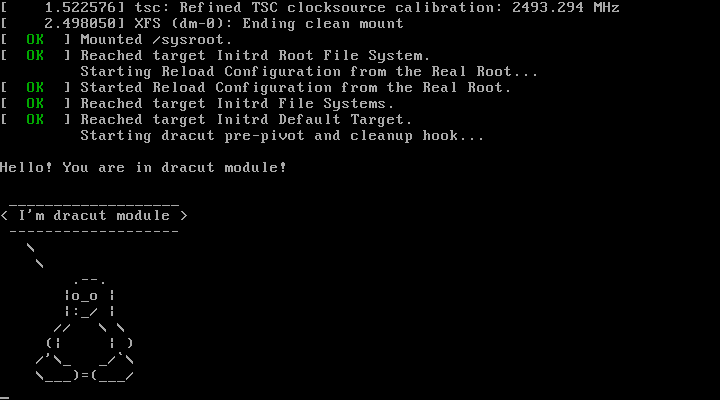

## Домашнее задание № 4 — «Загрузка системы»    <!-- omit in toc -->

### Оглавление  <!-- omit in toc -->

- [Запуск виртуальной машины](#Запуск-виртуальной-машины)
- [Вход в систему без пароля](#Вход-в-систему-без-пароля)
  - [Первый способ — используя init=/bin/sh](#Первый-способ--используя-initbinsh)
  - [Второй способ — используя rd.break](#Второй-способ--используя-rdbreak)
  - [Третий способ — используя rw init=/sysroot/bin/sh](#Третий-способ--используя-rw-initsysrootbinsh)
- [Переименование VG с системой](#Переименование-vg-с-системой)
- [Добавление модуля в initrd](#Добавление-модуля-в-initrd)

### Запуск виртуальной машины

Для создания виртуальной машины используется минимальный [Vagrantfile](Vagrantfile) с таким содержимым:

```ruby
Vagrant.configure("2") do |config|
  config.vm.box = "centos/7"
  config.vm.box_version = "1804.02"
end
```

Выбрана версия бокса **1804.02**, так как это последняя версия CentOS 7 для Vagrant'а, в которой корень распологается на LVM (это необходимо для второго задания).

Виртуальная машина поднимается командой `vagrant up`.

### Вход в систему без пароля

В этом пункте разобраны три способа войти в систему без пароля.

Во всех трёх случаях сначала необходимо произвести следующие действия:

1. Остановить виртуальную машину командой `vagrant halt`, после чего зайти в интерфейс VirtualBox и запустить машину кнопкой **Start**.

    *Альтернативный вариант*: зайти на запущенную машину через VirtualBox, используя логин `root` и пароль `vagrant`, и перезапустить её командой `reboot`.

2. Дождаться появления загрузочного меню с выбором ядра.
3. Выбрать загрузочную строку и нажать `e`, чтобы отредактировать её.
4. Перейти в строку, начинающуюся со слова `linux16`, и удалить параметр `console=ttyS0,115200n8`, чтобы отключить последовательный терминал (иначе в первом методе система уйдёт в критическую ошибку, во втором перейдёт к обычной загрузке с ожиданием логина и пароля, а в третьем просто зависнет), а также параметры `rhgb` и `quite`, чтобы включить отображение системных сообщений.
5. Дальнейшие действия зависят от выбранного способа входа в систему.

#### Первый способ — используя init=/bin/sh

1. Находясь в строке, начинающейся с `linux16`, добавить в её конец параметр `init=/bin/sh` (как вариант — `init=/bin/bash`) и нажать комбинацию `CTRL + X`, чтобы продолжить загрузку с изменёнными параметрами.
2. Мы загрузились в корневой каталог основной системы, который примонтирован в режиме «только для чтения» (read only, ro). Для того, что перемонтировать его в режим «чтение/запись» (read/write, rw), нужно выполнить команду:

    ```console
    sh-4.2# mount -o remount,rw /
    ```
    
    Ещё один способ: изменить параметр загрузки `ro` на `rw`.

3. После всех необходимых операций можно возобновить процесс загрузки с помощью команды:
    ```console
    sh-4.2# exec /sbin/init
    ```

**Описание**. В этом методе мы переопределяем стандартный процесс `init`, и после загрузки ядра вместо инициализации системы запускается интерактивная оболочка.

#### Второй способ — используя rd.break

1. Находясь в строке, начинающейся с `linux16`, добавить в её конец параметр `rd.break` и нажать комбинацию `CTRL + X`, чтобы продолжить загрузку с изменёнными параметрами.
2. Мы попали в аварийный режим (emergency mode). Корневой каталог основной системы примонтирован к **/sysroot** и находится в режиме «только для чтения» (read only, ro). Чтобы мы смогли изменить пароль, необходимо перемонтировать его в режим «чтение/запись» (read/write, rw) следующей командой:

    ```console
    switch_root:/# mount -o remount,rw /sysroot
    ```

3. Указать каталог **/sysroot** как корневой:

    ```console
    switch_root:/# chroot /sysroot
    ```
    При этом командная строка изменится и приобретёт следующий вид:

    ```console
    sh-4.2#
    ```

4. Изменить пароль пользователя **root**:
    
    ```console
    sh-4.2# passwd
    ```

5. Выполнение команды `passwd` приводит к созданию нового файла **/etc/shadow**. В аварийном режиме SELinux не работает, поэтому этот файл будет создан без контекста безопасности, что может привести к проблемам при перезагрузке системы. Чтобы избежать этих проблем, нужно создать файл **.autorelabel** в корневом каталоге:

    ```console
    sh-4.2# touch /.autorelabel
    ```

    Создание этого файла приведёт к автоматической переразметке всех файлов при следующей загрузке системы.
6. Выполнить команду `exit`, чтобы выйти из окружения `chroot`.
7. Ещё раз выполнить команду `exit`, чтобы выйти из аварийного режима и завершить загрузку системы.
8. Теперь мы можем войти в систему в новым паролем.

**Описание**. Этот метод заключается в прерывании процесса загрузки перед тем, как управление передаётся от **initramfs** к **systemd** (именно за это отвечает параметр `rd.break`). После прерывания появляется доступ к командной строке окружения **initramfs**, благодаря чему мы можем производить различные манипуляции с корневым каталогом.

#### Третий способ — используя rw init=/sysroot/bin/sh

1. Находясь в строке, начинающейся с `linux16`, стереть `ro` и заменить её параметрами `rw init=/sysroot/bin/sh` (как вариант — `rw init=/sysroot/bin/bash`). После этого использовать комбинацию `CTRL + X`, чтобы продолжить загрузку с изменёнными параметрами.
2. Дальнейшие действия аналогичны предыдущему способу, начиная с шага 3 (то есть команды `chroot /sysroot`).

### Переименование VG с системой

Все действия выполняются из-под пользователя **root**.

Проверим существующие группы томов:

```console
[root@localhost vagrant]# vgs
  VG         #PV #LV #SN Attr   VSize   VFree
  VolGroup00   1   2   0 wz--n- <38.97g    0 
```

Переименуем VG:

```console
[root@localhost vagrant]# vgrename VolGroup00 OtusRoot
  Volume group "VolGroup00" successfully renamed to "OtusRoot"
[root@localhost vagrant]# vgs
  VG       #PV #LV #SN Attr   VSize   VFree
  OtusRoot   1   2   0 wz--n- <38.97g    0 
```

Исправим файлы **/etc/fstab**, **/etc/default/grub** и **/boot/grub2/grub.cfg**, заменяя старое название VG на новое. Заодно удалим параметры `rghb`, `quiet` и `console=ttyS0,115200n8`.

**/etc/fstab**:

```ini
#
# /etc/fstab
# Created by anaconda on Sat May 12 18:50:26 2018
#
# Accessible filesystems, by reference, are maintained under '/dev/disk'
# See man pages fstab(5), findfs(8), mount(8) and/or blkid(8) for more info
#
/dev/mapper/OtusRoot-LogVol00 /                       xfs     defaults        0 0
UUID=570897ca-e759-4c81-90cf-389da6eee4cc /boot                   xfs     defaults        0 0
/dev/mapper/OtusRoot-LogVol01 swap                    swap    defaults        0 0
```

**/etc/default/grub**:

```ini
GRUB_TIMEOUT=1
GRUB_DISTRIBUTOR="$(sed 's, release .*$,,g' /etc/system-release)"
GRUB_DEFAULT=saved
GRUB_DISABLE_SUBMENU=true
GRUB_TERMINAL_OUTPUT="console"GRUB_CMDLINE_LINUX="no_timer_check console=tty net.ifnames=0 biosdevname=0 elevator=noop crashkernel=auto rd.lvm.lv=OtusRoot/LogVol00 rd.lvm.lv=OtusRoot/LogVol01"
GRUB_DISABLE_RECOVERY="true"
```

**/boot/grub2/grub.cfg**:

```ini
...
100 linux16 /vmlinuz-3.10.0-862.2.3.el7.x86_64 root=/dev/mapper/OtusRoot-LogVol00 ro no_timer_check console=tty net.ifnames=0 biosdevname=0 elevator=noop crashkernel=auto rd.lvm.lv=OtusRoot/LogVol00 rd.lvm.lv=OtusRoot/LogVol01
101 initrd16 /initramfs-3.10.0-862.2.3.el7.x86_64.img
...
```

Пересоздаем initrd image, чтобы он знал новое название группы томов:

```console
[root@localhost vagrant]# mkinitrd -f -v /boot/initramfs-$(uname -r).img $(uname -r)
...
*** Creating image file done ***
*** Creating initramfs image file '/boot/initramfs-3.10.0-862.2.3.el7.x86_64.img' done ***
```

Перезагрузим виртуальную машину командой `vagrant reload`, выполнив её на хосте, затем опять залогинимся в неё при помощи `vagrant ssh`.

Проверим, что система загрузилась с новым названием группы томов:

```console
[root@localhost vagrant]# vgs
  VG       #PV #LV #SN Attr   VSize   VFree
  OtusRoot   1   2   0 wz--n- <38.97g    0
```

### Добавление модуля в initrd

Создаём папку **01test** в каталоге **/usr/lib/dracut/modules.d/**:

```console
[root@localhost vagrant]# mkdir /usr/lib/dracut/modules.d/01test
[root@localhost vagrant]# cd /usr/lib/dracut/modules.d/01test
```

Создадим в ней два скрипта:

**module-setup.sh** — устанавливает модуль и вызывает скрипт test.sh:

```bash
#!/bin/bash

check() {
    return 0
}

depends() {
    return 0
}

install() {
    inst_hook cleanup 00 "${moddir}/test.sh"
}
```

**test.sh** — вызываемый скрипт, в котором отрисовывается пингвин:

```console
#!/bin/bash

exec 0<>/dev/console 1<>/dev/console 2<>/dev/console
cat <<'msgend'

Hello! You are in dracut module!

 ___________________
< I'm dracut module >
 -------------------
   \
    \
        .--.
       |o_o |
       |:_/ |
      //   \ \
     (|     | )
    /'\_   _/`\
    \___)=(___/
msgend
sleep 10
echo " continuing...."
```

Пересобираем образ initrd:

```console
[root@localhost ~]# dracut -f -v
Executing: /sbin/dracut -f -v
...
*** Creating image file done ***
*** Creating initramfs image file '/boot/initramfs-3.10.0-862.2.3.el7.x86_64.img' done ***
```

Проверим, что новый модуль загружен в образ:

```console
[root@localhost ~]# lsinitrd -m /boot/initramfs-$(uname -r).img | grep test
test
```

Разлогинимся из машины и остановим её командой `vagrant halt`, после чего зайдём в интерфейс VirtualBox и запустим машину кнопкой **Start**.

В итоге при загрузке будет пауза 10 секунд, и мы увидим пингвина в выводе терминала:



<br/>

[Вернуться к списку всех ДЗ](../README.md)