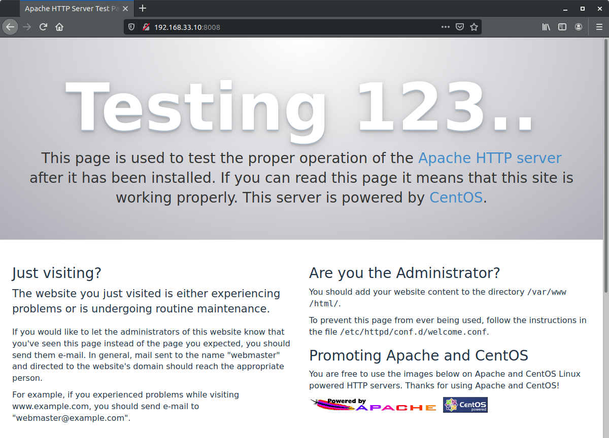
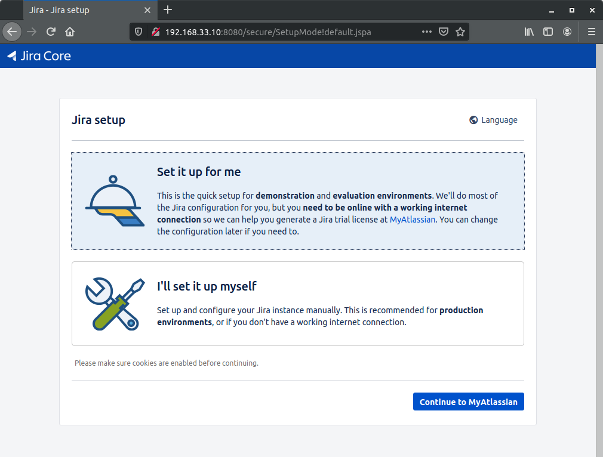

## Домашнее задание к занятию № 5 — «Инициализация системы. Systemd и SysV»    <!-- omit in toc -->

### Оглавление  <!-- omit in toc -->

- [Предварительное описание](#Предварительное-описание)
- [Задание 1. Сервис мониторинга](#Задание-1-Сервис-мониторинга)
- [Задание 2. Переписать Init-скрипт на Unit-файл](#Задание-2-Переписать-init-скрипт-на-unit-файл)
- [Задание 3. Разные конфигурационные файлы одного сервиса](#Задание-3-Разные-конфигурационные-файлы-одного-сервиса)
- [Дополнительное задание](#Дополнительное-задание)

### Предварительное описание

Для создания виртуальной машины используется [Vagrantfile](Vagrantfile) со следующим содержимым:

```ruby
Vagrant.configure("2") do |config|
  config.vm.box = "centos/7"
  config.vm.network "private_network", ip: "192.168.33.10"
  # Each provisioner for exact task
  config.vm.provision "first", type: "shell", path: "startup-scripts/first-task.sh"
  config.vm.provision "second", type: "shell", path: "startup-scripts/second-task.sh"
  config.vm.provision "third", type: "shell", path: "startup-scripts/third-task.sh"
  config.vm.provision "star", type: "shell", path: "startup-scripts/star-task.sh"
end
```

Для каждого задания написан свой скрипт предварительной настройки (provision) для раздельного запуска. Например, чтобы выполнить и проверить только второе задание, нужно запустить виртуальную машину следующей командой:

```console
$ vagrant up --provision-with second
```

При использовании команды `vagrant up` без параметров будут выполнены все скрипты предварительной настройки.

Скрипты предварительной настройки находятся в папке [startup-scripts](startup-scripts).

Файлы для копирования находятся в папке [files](files) и разделены на подкаталоги по заданиям.

Все файлы, содержащиеся в папке с Vagrantfile, при создании виртуальной машины копируются на неё в каталог **/vagrant**. Скрипты предварительной настройки работают именно с этим каталогом.

### Задание 1. Сервис мониторинга

Задание: написать сервис, который будет раз в 30 секунд мониторить лог на предмет наличия ключевого слова. Файл и слово должны задаваться в /etc/sysconfig.

#### Запуск <!-- omit in toc -->

При создании виртуальной машины запускается скрипт [**first-task.sh**](startup-scripts/first-task.sh), выполняющий следующие шаги:

1. В каталог **/etc/sysconfig/** копируется файл [**watchlog**](files/first-task/watchlog) с опциями для сервиса мониторинга (ключевое слово и файл, который нужно мониторить):

    ```ini
    WORD="ALERT"
    LOG=/var/log/watchlog.log
    ```

2. В каталог **/opt/** копируется файл [**watchlog.sh**](files/first-task/watchlog.sh), содержащий скрипт, который выполняет сервис:

    ```bash
    #!/bin/bash

    WORD=$1
    LOG=$2
    DATE=`date`

    if grep $WORD $LOG &> /dev/null
    then
        logger "$DATE: I found word, master!"
    else
        exit 0
    fi
    ```

    Этот скрипт проверяет указанный файл на наличие ключего слова (с отключением вывода) и, если находит его, оставляет сообщение в файле **/var/log/messages**.

3. В каталог **/etc/systemd/system/** копируются Unit-файлы самого сервиса [**watchlog.service**](files/first-task/watchlog.service) и его таймера [**watchlog.timer**](files/first-task/watchlog.timer).

    Unit-файл сервиса:

    ```ini
    [Unit]
    Description=My watchlog service

    [Service]
    Type=oneshot
    EnvironmentFile=/etc/sysconfig/watchlog
    ExecStart=/opt/watchlog.sh $WORD $LOG
    ```
    
    Unit-файл таймера:

    ```ini
    [Unit]
    Description=Run watchlog script every 30 second

    [Timer]
    # Запуск сервиса сразу после старта таймера
    OnActiveSec=0
    # Запуск сервиса каждые 30 секунд после его выполнения
    OnUnitActiveSec=30

    [Install]
    WantedBy=multi-user.target
    ```

4. В каталоге **/var/log/** создаётся пустой файл **watchlog.log** — его будет мониторить сервис.
5. Файлу **watchlog.sh** выдаются права на выполнение:
   
    ```bash
    chmod +x /opt/watchlog.sh
    ```

6. Запускается таймер и включается его автозапуск:
    
    ```bash
    systemctl start watchlog.timer
    systemctl enable watchlog.timer
    ```

#### Проверка <!-- omit in toc -->

1. Залогиниться на виртуальной машине командой `vagrant ssh`.
2. Проверить, что таймер запущен:
    
    ```console
    [vagrant@localhost ~]$ systemctl status watchlog.timer 
    ● watchlog.timer - Run watchlog script every 30 second
       Loaded: loaded (/etc/systemd/system/watchlog.timer; enabled; vendor preset: disabled)
       Active: active (waiting) since Wed 2020-01-08 15:53:46 UTC; 3min 56s ago
    ```

3. Проверить, что сервис watchlog запускается каждые 30 секунд:
    
    ```console
    [vagrant@localhost ~]$ watch -n 1 systemctl status watchlog
    ```

    ```console
    Every 1.0s: systemctl status watchlog

        watchlog.service - My watchlog service
       Loaded: loaded (/etc/systemd/system/watchlog.service; static; vendor preset: disabled)
       Active: inactive (dead) since Wed 2020-01-08 16:02:53 UTC; 22s ago
      Process: 4961 ExecStart=/opt/watchlog.sh $WORD $LOG (code=exited, status=0/SUCCESS)
     Main PID: 4961 (code=exited, status=0/SUCCESS)
    ```

4. Записать в файл **/var/log/watchlog.log** слово «ALERT»:

    ```console
    [vagrant@localhost ~]$ echo 'ALERT' | sudo tee -a /var/log/watchlog.log > /dev/null
    ```

5. Проверить файл **/var/log/messages**:

    ```console
    [vagrant@localhost ~]$ sudo tail -f /var/log/messages
    ...
    Jan  8 16:34:08 localhost systemd: Started My watchlog service.
    Jan  8 16:35:02 localhost systemd: Starting My watchlog service...
    Jan  8 16:35:02 localhost root: Wed Jan  8 16:35:02 UTC 2020: I found word, master!
    Jan  8 16:35:02 localhost systemd: Started My watchlog service.
    ...
    ```

### Задание 2. Переписать Init-скрипт на Unit-файл

Задание: из epel установить spawn-fcgi и переписать Init-скрипт на Unit-файл. Имя сервиса должно называться так же.

#### Запуск <!-- omit in toc -->

При создании виртуальной машины запускается скрипт [**second-task.sh**](startup-scripts/second-task.sh), выполняющий следующие шаги:

1. Устанавливается spawn-fcgi и необходимые для него пакеты.
2. Содержимое файла опций **/etc/sysconfig/spawn-fcgi** заменяется [следующим](files/second-task/spawn-fcgi):
    
    ```ini
    SOCKET=/var/run/php-fcgi.sock
    OPTIONS="-u apache -g apache -s $SOCKET -S -M 0600 -C 32 -F 1 -- /usr/bin/php-cgi"
    ```

3. В каталог **/etc/systemd/system/** копируeтся Unit-файл сервиса [**spawn-fcgi.service**](files/second-task/spawn-fcgi.service):

    ```ini
    [Unit]
    Description=Spawn-fcgi startup service by Otus
    After=network.target

    [Service]
    Type=simple
    PIDFile=/var/run/spawn-fcgi.pid
    EnvironmentFile=/etc/sysconfig/spawn-fcgi
    ExecStart=/usr/bin/spawn-fcgi -n $OPTIONS
    KillMode=process

    [Install]
    WantedBy=multi-user.target
    ```

4. Запускается сервис и включается его автозапуск:
    
    ```bash
    systemctl start spawn-fcgi
    systemctl enable spawn-fcgi
    ```

#### Проверка <!-- omit in toc -->

1. Залогиниться на виртуальной машине командой `vagrant ssh`.
2. Убедиться, что сервис запущен:
    
    ```console
    [vagrant@localhost ~]$ systemctl status spawn-fcgi
    ● spawn-fcgi.service - Spawn-fcgi startup service by Otus
       Loaded: loaded (/etc/systemd/system/spawn-fcgi.service; enabled; vendor preset: disabled)
       Active: active (running) since Wed 2020-01-08 17:04:35 UTC; 30s ago
     Main PID: 5644 (php-cgi)
       CGroup: /system.slice/spawn-fcgi.service
               ├─5644 /usr/bin/php-cgi
               ...
               └─5689 /usr/bin/php-cgi
    ```

### Задание 3. Разные конфигурационные файлы одного сервиса

Задание: дополнить Unit-файл httpd возможностью запустить несколько инстансов сервера с разными конфигурационными файлами.

#### Запуск <!-- omit in toc -->

При создании виртуальной машины запускается скрипт [**third-task.sh**](startup-scripts/third-task.sh), выполняющий следующие шаги:

1. Устанавливается httpd (если его нет в системе).
2. В каталог **/etc/systemd/system/** копируeтся параметризированный Unit-файл сервиса [**httpd@.service**](files/third-task/httpd@.service):

    ```ini
    [Unit]
    Description=The Apache HTTP Server
    After=network.target remote-fs.target nss-lookup.target
    Documentation=man:httpd(8)
    Documentation=man:apachectl(8)

    [Service]
    Type=notify
    EnvironmentFile=/etc/sysconfig/httpd-%I
    ExecStart=/usr/sbin/httpd $OPTIONS -DFOREGROUND
    ExecReload=/usr/sbin/httpd $OPTIONS -k graceful
    ExecStop=/bin/kill -WINCH ${MAINPID}
    KillSignal=SIGCONT
    PrivateTmp=true

    [Install]
    WantedBy=multi-user.target
    ```

3. В каталог **/etc/sysconfig/** копируются файлы с опциями для различных конфигураций, в которых различаются ссылки на конфигурационные файлы httpd.

    [**httpd-first**](files/third-task/httpd-first):

    ```ini
    OPTIONS=-f conf/first.conf
    ```

    [**httpd-second**](files/third-task/httpd-second):

    ```ini
    OPTIONS=-f conf/second.conf
    ```

4. В каталог **/etc/httpd/conf/** копируются конфигурационные файлы [**first.conf**](files/third-task/first.conf) и [**second.conf**](files/third-task/second.conf). Они отличаются от основного конфига **httpd.conf** и друг от друга опциями `Listen` (порт) и `PidFile`.

    [**first.conf**](files/third-task/first.conf):

    ```ini
    ...
    Listen 8008
    PidFile /var/run/httpd-first.pid
    ...
    ```

    [**second.conf**](files/third-task/second.conf):

    ```ini
    ...
    Listen 8009
    PidFile /var/run/httpd-second.pid
    ...
    ```

    Выбраны порты 8008 и 8009, так как они разрешены для httpd политиками SELinux.

5. Запускаются два сервиса с разными параметрами:

    ```bash
    systemctl start httpd@first
    systemctl start httpd@second
    ```

#### Проверка <!-- omit in toc -->

1. Залогиниться на виртуальной машине командой `vagrant ssh`.
2. Убедиться, что оба сервиса запущены:

    ```console
    [vagrant@localhost ~]$ systemctl status httpd@first
    ● httpd@first.service - The Apache HTTP Server
       Loaded: loaded (/etc/systemd/system/httpd@.service; disabled; vendor preset: disabled)
       Active: active (running) since Wed 2020-01-08 17:16:25 UTC; 53min ago
         Docs: man:httpd(8)
               man:apachectl(8)
     Main PID: 4914 (httpd)
       Status: "Total requests: 15; Current requests/sec: 0; Current traffic:   0 B/sec"
       CGroup: /system.slice/system-httpd.slice/httpd@first.service
               ├─4914 /usr/sbin/httpd -f conf/first.conf -DFOREGROUND
               ...
               └─5177 /usr/sbin/httpd -f conf/first.conf -DFOREGROUND
    ```

    ```console
    [vagrant@localhost ~]$ systemctl status httpd@second
    ● httpd@second.service - The Apache HTTP Server
       Loaded: loaded (/etc/systemd/system/httpd@.service; disabled; vendor preset: disabled)
       Active: active (running) since Wed 2020-01-08 17:16:25 UTC; 56min ago
         Docs: man:httpd(8)
               man:apachectl(8)
     Main PID: 4921 (httpd)
       Status: "Total requests: 10; Current requests/sec: 0; Current traffic:   0 B/sec"
       CGroup: /system.slice/system-httpd.slice/httpd@second.service
               ├─4921 /usr/sbin/httpd -f conf/second.conf -DFOREGROUND
               ...
               └─5180 /usr/sbin/httpd -f conf/second.conf -DFOREGROUND
    ```

3. Посмотреть, какие порты слушаются:

    ```console
    [vagrant@localhost ~]$ sudo ss -tnulp | grep httpd
    tcp    LISTEN     0      128      :::8008                 :::*                   users:(("httpd",pid=5177,fd=4),("httpd",pid=5176,fd=4),("httpd",pid=5175,fd=4),("httpd",pid=4919,fd=4),(httpd",pid=4918,fd=4),("httpd",pid=4917,fd=4),("httpd",pid=4916,fd=4),("httpd",pid=4915,fd=4),("httpd",pid=4914,fd=4))
    tcp    LISTEN     0      128      :::8009                 :::*                   users:(("httpd",pid=5180,fd=4),("httpd",pid=5179,fd=4),("httpd",pid=5178,fd=4),("httpd",pid=4926,fd=4),(httpd",pid=4925,fd=4),("httpd",pid=4924,fd=4),("httpd",pid=4923,fd=4),("httpd",pid=4922,fd=4),("httpd",pid=4921,fd=4))
    ```

4. На хостовой машине в браузере открыть страницу http://192.168.33.10:8008 или http://192.168.33.10:8009 (где IP-адрес — это адрес, указанный в [Vagrantfile](Vagrantfile)) и убедиться, что httpd работает:

    

### Дополнительное задание

Задание со звёздочкой: скачать демо-версию Atlassian Jira и переписать основной скрипт запуска на Unit-файл.

#### Запуск <!-- omit in toc -->

При создании виртуальной машины запускается скрипт [**star-task.sh**](startup-scripts/star-task.sh), выполняющий следующие шаги:

1. Устанавливается wget.
2. Устанавливается Java 8.
3. Для всех пользователей задаётся переменная окружения `JAVA_HOME`, в которой содержится путь до домашнего каталога Java:

    ```bash
    echo export JAVA_HOME=$(readlink -nf $(which java) | xargs dirname | xargs dirname) >> /etc/environment
    ```

4. Создаётся инсталяционная директория, куда Jira будет установлена:

    ```bash
    mkdir -p /opt/atlassian/jira
    ```

5. Создаётся домашняя директория Jira, где будут храниться файлы приложения:

    ```bash
    mkdir -p /var/atlassian/application-data/jira
    ```

6. Скачивается архив с Jira, файлы из него распаковываются в инсталяционную директорию:

    ```bash
    wget https://product-downloads.atlassian.com/software/jira/downloads/atlassian-jira-software-8.6.0.tar.gz
    tar zxvf atlassian-jira-software-8.6.0.tar.gz -C /opt/atlassian/jira --strip-components 1
    ```

    В архиве все файлы содержатся в каталоге **atlassian-jira-software-8.6.0-standalone**. Чтобы файлы распаковались напрямую в **/opt/atlassian/jira** (без включения их родительского каталога в путь), используется ключ `--strip-components 1`.

7. Создаётся пользователь для работы с Jira:

    ```bash
    useradd --create-home -c "Jira role account" jira
    ```

8. Пользователь **jira** назначается владельцем инсталяционной и домашней директорий Jira:

    ```bash
    chown -R jira: /opt/atlassian/jira
    chown -R jira: /var/atlassian/application-data/jira
    ```

9. В конфигурационном файле **jira-application.properties** указывается путь до домашней директории:

    ```bash
    sed -i 's|^jira.home =|jira.home = /var/atlassian/application-data/jira|' /opt/atlassian/jira/atlassian-jira/WEB-INF/classes/jira-application.properties
    ```

10. В каталог **/etc/systemd/system/** копируeтся Unit-файл сервиса [**jira.service**](files/star-task/jira.service):

    ```ini
    [Unit] 
    Description=Jira Service
    After=network.target

    [Service] 
    Type=forking
    User=jira
    PIDFile=/opt/atlassian/jira/work/catalina.pid
    ExecStart=/opt/atlassian/jira/bin/start-jira.sh
    ExecStop=/opt/atlassian/jira/bin/stop-jira.sh

    [Install] 
    WantedBy=multi-user.target
    ```

11. Запускается сервис и включается его автозапуск:
    
    ```bash
    systemctl start jira
    systemctl enable jira
    ```

#### Проверка <!-- omit in toc -->

1. Залогиниться на виртуальной машине командой `vagrant ssh`.
2. Убедиться, что сервис запущен:

    ```console
    [vagrant@localhost ~]$ systemctl status jira
    ● jira.service - Jira Service
       Loaded: loaded (/etc/systemd/system/jira.service; enabled; vendor preset: disabled)
       Active: active (running) since Thu 2020-01-09 00:21:33 UTC; 39s ago
     Main PID: 5920 (java)
       CGroup: /system.slice/jira.service
               └─5920 /usr/bin/java -Djava.util.logging.config.file=/opt/atlassian/jira/conf/logging.properties -Djava.util.logging.manager=org.apache.juli.ClassLoaderLogManager -Xms384m ...
    ```

3. На хостовой машине в браузере открыть страницу http://192.168.33.10:8080 (где IP-адрес — это адрес, указанный в [Vagrantfile](Vagrantfile)) и убедиться, что Jira работает:

    

<br/>

[Вернуться к списку всех ДЗ](../README.md)