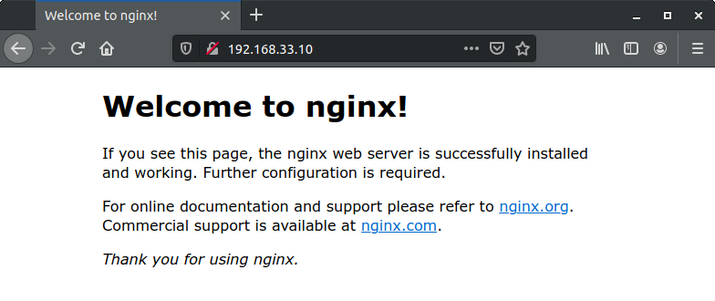
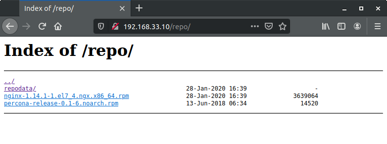

## Домашнее задание к занятию № 7 — «Управление пакетами. Дистрибьюция софта»    <!-- omit in toc -->

### Оглавление  <!-- omit in toc -->

- [Запуск виртуальной машины](#Запуск-виртуальной-машины)
  - [Создание RPM-пакета](#Создание-rpm-пакета)
  - [Создание репозитория](#Создание-репозитория)
- [Проверка](#Проверка)
  - [Проверка пакета](#Проверка-пакета)
  - [Проверка репозитория](#Проверка-репозитория)

### Запуск виртуальной машины

Для создания виртуальной машины используется [Vagrantfile](Vagrantfile) со следующим содержимым:

```ruby
Vagrant.configure("2") do |config|
  config.vm.box = "centos/7"
  config.vm.network "private_network", ip: "192.168.33.10"
  config.vm.provision "shell", path: "rpm.sh"
  config.vm.provision "shell", path: "repo.sh"
end
```

При выполнении команды `vagrant up` создаётся виртуальная машина с CentOS 7, внутри которой последовательно выполняются скрипты предварительной настройки [rpm.sh](rpm.sh) и [repo.sh](repo.sh). В первом скрипте создаётся RPM-пакет, во втором — репозиторий.

#### Создание RPM-пакета

Скрипт [rpm.sh](rpm.sh) выполняет следующие действия:

1. Объявляет рабочим каталогом домашнюю директорию пользователя root:

    ```bash
    cd /root
    ```

2. Устанавливает нужные для работы пакеты:

    ```bash
    yum install -y redhat-lsb-core wget rpmdevtools rpm-build createrepo yum-utils gcc
    ```

3. Загружает SRPM-пакет Nginx для дальнейшей работы над ним:

    ```bash
    wget https://nginx.org/packages/centos/7/SRPMS/nginx-1.14.1-1.el7_4.ngx.src.rpm
    ```

4. Устанавливает загруженный пакет Nginx в домашнем каталоге пользователя root:

    ```bash
    rpm -i nginx-1.14.1-1.el7_4.ngx.src.rpm
    ```

5. Скачивает и разархивирует исходники для openssl:

    ```bash
    wget https://www.openssl.org/source/latest.tar.gz
    tar -xf latest.tar.gz
    ```

6. Устанавливает зависимости, чтобы в процессе сборки не было ошибок:

    ```bash
    yum-builddep -y rpmbuild/SPECS/nginx.spec
    ```

7. Используя sed, добавляет параметр `--with-openssl` с путём до распакованных исходников в spec-файл, чтобы Nginx собирался с необходимыми опциями:

    ```bash
    ospath="\    --with-openssl=/root/$(ls | grep openssl) \\\\"
    sed -i "/\.\/configure/a $ospath" rpmbuild/SPECS/nginx.spec
    ```

8. Собирает RPM-пакет:

    ```bash
    rpmbuild -bb rpmbuild/SPECS/nginx.spec
    ```

9. Уставливает собранный пакет, используя программу yum:

    ```bash
    yum localinstall -y rpmbuild/RPMS/x86_64/nginx-1.14.1-1.el7_4.ngx.x86_64.rpm
    ```

10. Запускает службу Nginx:

    ```bash
    systemctl start nginx
    systemctl enable nginx
    ```

#### Создание репозитория

Скрипт [repo.sh](repo.sh) выполняет следующие действия:

1. Создаёт каталог **repo** в директории **/usr/share/nginx/html**:

    ```bash
    mkdir /usr/share/nginx/html/repo
    ```

2. Копирует в этот каталог два RPM-пакета: пакет Nginx, собранный при выполнении предыдущего скрипта, и пакет для установки репозитория Percona-Server (предварительно загрузив его из сети):

    ```bash
    cp /root/rpmbuild/RPMS/x86_64/nginx-1.14.1-1.el7_4.ngx.x86_64.rpm /usr/share/nginx/html/repo/
    wget http://www.percona.com/downloads/percona-release/redhat/0.1-6/percona-release-0.1-6.noarch.rpm -O /usr/share/nginx/html/repo/percona-release-0.1-6.noarch.rpm
    ```

3. Инициализирует репозиторий:

    ```bash
    createrepo /usr/share/nginx/html/repo/
    ```

4. Настраивает в Nginx доступ к листингу каталога: при помощи sed добавляет директиву `autoindex on` в location / в файле **/etc/nginx/conf.d/default.conf** и перезапускает Nginx:

    ```bash
    sed -i '/index.html index.htm/a \        autoindex on;' /etc/nginx/conf.d/default.conf
    nginx -s reload
    ```

5. Добавляет репозиторий в **/etc/yum.repos.d**:

    ```bash
    cat >> /etc/yum.repos.d/otus.repo << EOF
    [otus]
    name=otus-linux
    baseurl=http://localhost/repo
    gpgcheck=0
    enabled=1
    EOF
    ```

### Проверка

#### Проверка пакета

Залогинимся на виртуальной машине командой `vagrant ssh` и выполним следующие действия:

1. Убедимся, что пакеты создались:

    ```console
    [vagrant@localhost ~]$ sudo ls -l /root/rpmbuild/RPMS/x86_64/
    total 6048
    -rw-r--r--. 1 root root 3639064 Jan 28 16:39 nginx-1.14.1-1.el7_4.ngx.x86_64.rpm
    -rw-r--r--. 1 root root 2548764 Jan 28 16:39 nginx-debuginfo-1.14.1-1.el7_4.ngx.x86_64.rpm
    ```

2. Проверим статус службы Nginx:

    ```console
    [vagrant@localhost ~]$ systemctl status nginx
    ● nginx.service - nginx - high performance web server
       Loaded: loaded (/usr/lib/systemd/system/nginx.service; enabled; vendor preset: disabled)
       Active: active (running) since Tue 2020-01-28 16:39:35 UTC; 2min 22s ago
         Docs: http://nginx.org/en/docs/
     Main PID: 29400 (nginx)
       CGroup: /system.slice/nginx.service
               ├─29400 nginx: master process /usr/sbin/nginx -c /etc/nginx/nginx.conf
               └─29529 nginx: worker process
    ```

На хостовой машине в браузере откроем страницу http://192.168.33.10 (где IP-адрес — это адрес, указанный в [Vagrantfile](Vagrantfile)) и убедимся, что Nginx работает:



#### Проверка репозитория

Залогинимся на виртуальной машине командой `vagrant ssh` и выполним следующие действия:

1. Проверим, что репозиторий добавлен в список yum:

    ```console
    [vagrant@localhost ~]$ yum repolist enabled | grep otus
    otus                                otus-linux                                 2
    ```

2. Проверим список пакетов в созданном репозитории:

    ```console
    [vagrant@localhost ~]$ yum list | grep otus
    percona-release.noarch                      0.1-6                      otus
    ```

    Пакет Nginx не отображается, так как он был установлен ранее из RPM-пакета. Переустановим его и проверим список ещё раз:

    ```console
    [vagrant@localhost ~]$ sudo yum reinstall -y -q nginx 
    [vagrant@localhost ~]$ yum list | grep otus
    nginx.x86_64                                1:1.14.1-1.el7_4.ngx       @otus    
    percona-release.noarch                      0.1-6                      otus 
    ```

На хостовой машине в браузере откроем страницу http://192.168.33.10/repo (где IP-адрес — это адрес, указанный в [Vagrantfile](Vagrantfile)) и проверим наличие загруженных в папку репозитория пакетов:



<br/>

[Вернуться к списку всех ДЗ](../README.md)