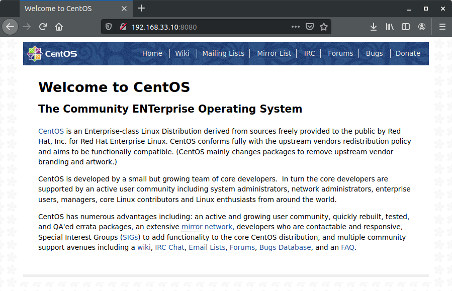

## Домашнее задание к занятию № 10 — «Автоматизация администрирования. Ansible»    <!-- omit in toc -->

### Оглавление  <!-- omit in toc -->

- [Задание](#Задание)
- [Что сделано](#Что-сделано)
- [Как проверить](#Как-проверить)

### Задание

Подготовить стенд на Vagrant как минимум с одним сервером. На этом сервере, используя Ansible, развернуть Nginx со следующими условиями:
- использовать модуль yum;
- конфигурационные файлы должны быть взяты из шаблона Jinja2 с переменными;
- после установки Nginx должен быть в режиме enabled в Systemd;
- должен быть использован notify для старта Nginx после установки;
- сайт должен слушать на нестандартном порту — 8080, для этого использовать переменные;
- сделать все это с использованием роли (задание со звёздочкой).

### Что сделано

1. Создана [роль Ansible для установки Nginx](provisioning/roles/nginx). Роль включает в себя:
   - [задачи (tasks)](provisioning/roles/nginx/tasks/main.yml) — установка репозитория EPEL и Nginx, запуск Nginx и перевод его в статус enabled, замена стандартного файла конфигурации на пользовательский c последующим вызовом обработчика:

     ```yml
      ---
      - name: Install EPEL repo and Nginx
        yum:
          name: "{{ item }}"
          state: latest
        loop:
          - epel-release
          - nginx
      - name: Start and enable Nginx
        systemd:
          name: nginx
          state: started
          enabled: yes
      - name: copy config nginx
        template:
          src: nginx.conf.j2
          dest: /etc/nginx/nginx.conf
        notify: Restart Nginx
     ```

   - [обработчик (handler)](provisioning/roles/nginx/handlers/main.yml) — перезапуск Nginx:

     ```yml
     ---
     - name: Restart Nginx
       systemd:
         name: nginx
         state: restarted
     ```

   - [шаблонизированный файл конфигурации Nginx](provisioning/roles/nginx/templates/nginx.conf.j2), в котором прослушиваемый порт задаётся переменной `http_port`.

2. Создан плейбук [install_nginx.yml](provisioning/install_nginx.yml), в котором запускается роль по установке Nginx и определяется значение переменной `http_port`:

    ```yml
    ---
    - hosts: all
      become: true
      gather_facts: false
      roles:
      - role: nginx
        vars:
          http_port: 8080
    ```

3. Создан [Vagrantfile](Vagrantfile), в котором плейбук [install_nginx.yml](provisioning/install_nginx.yml) используется для предварительной настройки (provisioning) виртуальной машины:

    ```ruby
    Vagrant.configure("2") do |config|
      config.vm.box = "centos/7"
      config.vm.network "private_network", ip: "192.168.33.10"
      config.vm.provision "ansible" do |ansible|
        ansible.playbook = "provisioning/install_nginx.yml"
      end
    end
    ```

Структура каталога выглядит следующим образом:

```console
$ tree
.
├── provisioning
│   ├── install_nginx.yml
│   └── roles
│       └── nginx
│           ├── handlers
│           │   └── main.yml
│           ├── tasks
│           │   └── main.yml
│           └── templates
│               └── nginx.conf.j2
├── README.md
└── Vagrantfile
```

### Как проверить

1. Создать виртуальную машину, выполнив команду `vagrant up`.
2. Открыть в браузере страницу http://192.168.33.10:8080 (где IP-адрес — это адрес, указанный в Vagrantfile) и убедиться, что Nginx работает:

    

<br/>

[Вернуться к списку всех ДЗ](../README.md)