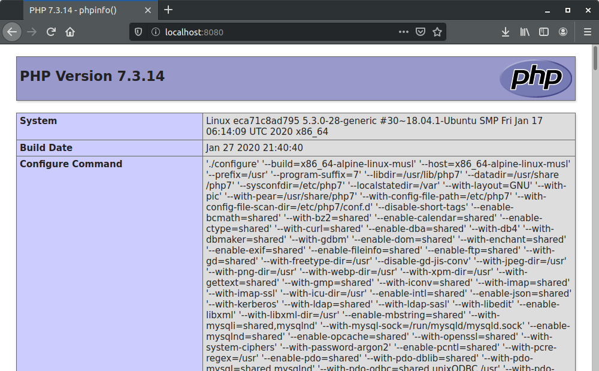

## Домашнее задание к занятию № 11 — «Docker»    <!-- omit in toc -->

### Оглавление  <!-- omit in toc -->

- [Задание](#Задание)
- [Что сделано](#Что-сделано)
- [Как проверить](#Как-проверить)

### Задание

Создать кастомные образы Nginx и PHP, объединить их в Docker Compose. После запуска Nginx должен показывать PHP Info. Все собранные образы должны быть в Docker Hub (задание со звездой).

### Что сделано

1. Установлены docker и docker-compose.
2. Создан [Dockerfile](nginx/Dockerfile) для Nginx:

    ```dockerfile
    FROM alpine:latest
    RUN apk update && apk add --no-cache nginx && \
        ln -s /dev/stdout /var/log/nginx/access.log && \ 
        ln -s /dev/stderr /var/log/nginx/error.log && \
        mkdir -p /run/nginx
    CMD ["nginx", "-g", "daemon off;"]
    ```

3. Создан [Dockerfile](php-fpm/Dockerfile) для PHP-FPM:

    ```dockerfile
    FROM alpine:latest
    RUN apk update && apk add --no-cache php7 php7-fpm && \
        ln -s /dev/stderr /var/log/php7/error.log && \
        sed -i 's/listen = 127.0.0.1:9000/listen = 9000/' /etc/php7/php-fpm.d/www.conf
    CMD ["php-fpm7", "-F"]
    ```

4. На основе этих файлов при помощи команды `docker build` созданы образы **rustsh/otus-nginx** и **rustsh/otus-php-fpm**.
5. Созданные образы загружены в Docker Hub при помощи команды `docker push`.
6. Созданы файлы:

   - [default.conf](nginx/default.conf) — файл конфигурации Nginx, в котором настроено подключение PHP-FPM:
        
     ```nginx
     server {
         listen 80;

         root /var/www/html;
         index info.php;

         location / {
             try_files $uri $uri/ /info.php?$query_string;
         }

         location ~ \.php$ {
             try_files $uri =404;
             fastcgi_split_path_info ^(.+\.php)(/.+)$;
             fastcgi_pass php-fpm:9000;
             fastcgi_index info.php;
             include fastcgi_params;
             fastcgi_param SCRIPT_FILENAME $document_root$fastcgi_script_name;
             fastcgi_param PATH_INFO $fastcgi_path_info;
         }
     }
     ```

   - [info.php](info.php) — скрипт вывода PHP Info:

     ```php
     <?php
     phpinfo();
     ?>
     ```

7. Создан файл [docker-compose.yml](docker-compose.yml), при помощи которого на основе собранных образов поднимаются контейнеры с Nginx и PHP, объединённые сетью, в них прокидываются файлы [default.conf](nginx/default.conf) и [info.php](info.php), а порт из контейнера с Nginx пробрасывается наружу:

    ```yml
    version: '3'
    services:
      nginx:
        image: rustsh/otus-nginx:1.0
        container_name: otus-nginx
        ports:
          - "8080:80"
        volumes:
          - ./info.php:/var/www/html/info.php
          - ./nginx/default.conf:/etc/nginx/conf.d/default.conf
        depends_on:
          - php-fpm
        networks:
          - nginx-php
      
      php-fpm:
        image: rustsh/otus-php-fpm:1.0
        container_name: otus-php-fpm
        volumes:
          - ./info.php:/var/www/html/info.php
        networks:
          - nginx-php

    networks:
      nginx-php:
    ```

### Как проверить

Собранные образы доступны в Docker Hub по ссылкам:

- Nginx — https://hub.docker.com/repository/docker/rustsh/otus-nginx
- PHP-FPM — https://hub.docker.com/repository/docker/rustsh/otus-php-fpm/

Для локального запуска на машине должны быть установлены docker и docker-compose.

В папке с файлом **docker-compose.yml** выполнить команду `docker-compose up -d`.

Перейти в браузер, открыть страницу [localhost:8080](http://localhost:8080/) и убедиться, что выводится PHP Info:



<br/>

[Вернуться к списку всех ДЗ](../README.md)