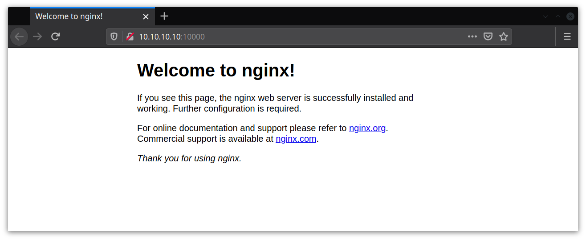

## Домашнее задание к занятию № 12 — «SELinux»  <!-- omit in toc -->

### Оглавление  <!-- omit in toc -->

- [Задание 1](#Задание-1)
  - [Предварительная настройка стенда](#Предварительная-настройка-стенда)
  - [Переключатели setsebool](#Переключатели-setsebool)
  - [Добавление нестандартного порта в имеющийся тип](#Добавление-нестандартного-порта-в-имеющийся-тип)
  - [Формирование и установка модуля SELinux](#Формирование-и-установка-модуля-selinux)
- [Задание 2](#Задание-2)
  - [Причина неработоспособности](#Причина-неработоспособности)
  - [Варианты решения](#Варианты-решения)
  - [Применение решения](#Применение-решения)
  - [Проверка решения](#Проверка-решения)

### Задание 1

Запустить Nginx на нестандартном порту тремя разными способами:
  - переключатели setsebool;
  - добавление нестандартного порта в имеющийся тип;
  - формирование и установка модуля SELinux.

#### Предварительная настройка стенда

Все файлы для первого задания находятся в каталоге [task_one](task_one).

Для создания стенда используется Vagrant ([Vagrantfile](task_one/Vagrantfile)). Для настройки стенда создана Ansible-роль [nginx](task_one/provisioning/roles/nginx).

Предварительная настройка включает в себя следующие шаги:

1. Устанавливаются нужные для работы с SELinux пакеты: policycoreutils-python, setroubleshoot, setools.
2. Переключатель nis_enabled переводится в режим `on`.
3. В тип http_port_t добавляется нестандартный порт 200.
4. Устанавливается и запускается Nginx, который слушает порты 80, 10000 и 200 ([default.conf](task_one/provisioning/roles/nginx/files/default.conf)).

В конфигурационном файле Nginx также указан для прослушивания порт 300, но строка с ним закомментирована — соответствующий модуль SELinux будем устанавливать вручную.

Чтобы создать и сконфигурировать стенд, достаточно выполнить команду `vagrant up`.

Для проверки работы необходимо на хостовой системе в браузере перейти на страницу http://10.10.10.10/ с указанием соответствующего порта (IP-адрес задаётся в [Vagrantfile](task_one/Vagrantfile)).

#### Переключатели setsebool

Переключатели не позволяют открыть любой порт, но мы можем включить правило для существующего типа.

Список всех типов для портов можно получить командой `semanage port -l`. Нас интересует тип unreserved_port_t:

```console
[root@webserver ~]# semanage port -l | grep unreserved
unreserved_port_t              sctp     1024-65535
unreserved_port_t              tcp      61001-65535, 1024-32767
unreserved_port_t              udp      61001-65535, 1024-32767
```

Используем порт 10000 из указанного диапазона.

Проверим, какой переключатель активирует правило, разрешающее Nginx слушать порты этого типа:

```console
[root@webserver ~]# sesearch -s httpd_t -t unreserved_port_t -AC | grep unreserved
ET allow nsswitch_domain unreserved_port_t : tcp_socket name_connect ; [ nis_enabled ]
ET allow nsswitch_domain unreserved_port_t : tcp_socket name_bind ; [ nis_enabled ]
ET allow nsswitch_domain unreserved_port_t : udp_socket name_bind ; [ nis_enabled ]
```

Нужный переключатель — nis_enabled — указан в квадратных скобках. Команда для включения переключателя nis_enabled:

```console
[root@webserver ~]# setsebool -P nis_enabled on
```

Таск Ansible:

```yml
- name: Set nis_enabled flag on and keep it persistent across reboots
  seboolean:
    name: nis_enabled
    state: yes
    persistent: yes
```

Убедимся, что Nginx слушает порт 10000:



#### Добавление нестандартного порта в имеющийся тип

Команда для добавления нестандартного порта в имеющийся тип:

```console
[root@webserver ~]# semanage port -a -t http_port_t -p tcp 200
```

Таск Ansible:

```yml
- name: Allow Nginx to listen on tcp port 200
  seport:
    ports: 200
    proto: tcp
    setype: http_port_t
    state: present
```

Подключимся к виртуальной машине и убедимся, что порт добавлен в тип:

```console
[root@webserver ~]# semanage port -l | grep http_port
http_port_t                    tcp      200, 80, 81, 443, 488, 8008, 8009, 8443, 9000
```

Убедимся, что Nginx слушает порт 200:


#### Формирование и установка модуля SELinux

1. Подключимся к виртуальной машине командой `vagrant ssh` и залогинимся под пользователем root:

    ```console
    [vagrant@webserver ~]$ sudo -i
    ```

2. Откроем файл **/etc/nginx/conf.d/default.conf** и раскомментируем строку `listen 300;`, а также закомментируем строку `listen 10000;`. Сохраним и закроем файл.
3. Временно деактивируем переключатель nis_enabled, чтобы получить нужное сообщение об ошибке в файле **/var/log/audit/audit.log** (порт 10000 на предыдущем шаге закомментировали, чтобы он в это сообщение не попал):

    ```console
    [root@webserver ~]# setsebool nis_enabled off
    ```

4. Перезапустим службу nginx, ожидаемо получим сообщение об ошибке:

    ```console
    [root@webserver ~]# systemctl restart nginx
    Job for nginx.service failed because the control process exited with error code. See "systemctl status nginx.service" and "journalctl -xe" for details.
    ```

5. Чтобы получить подробную информацию об ошибке, а также способы её решения, можно выполнить команду `sealert -a /var/log/audit/audit.log` (входит в состав пакета setroubleshoot):

    ```console
    [root@webserver ~]# sealert -a /var/log/audit/audit.log 
    ...
    SELinux is preventing /usr/sbin/nginx from name_bind access on the tcp_socket port 300.
    ...
    ```

6. При помощи alert2allow создадим новый модуль SELinux, разрешающий Nginx слушать порт 300 (необходимые команды содержатся в выводе sealert):

    ```console
    [root@webserver ~]# ausearch -c 'nginx' --raw | audit2allow -M my-nginx
    ******************** IMPORTANT ***********************
    To make this policy package active, execute:

    semodule -i my-nginx.pp
    ```

7. Проверим, что в текущем каталоге появились нужные файлы:

    ```console
    [root@webserver ~]# ls my-nginx*
    my-nginx.pp  my-nginx.te
    ```

8. Установим только что созданный модуль SELinux:

    ```console
    [root@webserver ~]# semodule -i my-nginx.pp
    ```

9.  Проверим, что модуль установлен:

    ```console
    [root@webserver ~]# semodule -l | grep my-nginx
    my-nginx        1.0
    ```

10. Перезапустим Nginx командой `systemctl restart nginx`.
11. Убедимся, что теперь Nginx работает и слушает порт 300:

    

### Задание 2

Обеспечить работоспособность приложения при включенном SELinux.
  - развернуть приложенный стенд: https://github.com/mbfx/otus-linux-adm/blob/master/selinux_dns_problems/;
  - выяснить причину неработоспособности механизма обновления зоны (см. README);
  - предложить решение (или решения) для данной проблемы;
  - выбрать одно из решений для реализации, предварительно обосновав выбор;
  - реализовать выбранное решение и продемонстрировать его работоспособность.

#### Причина неработоспособности

Согласно [документации](https://access.redhat.com/documentation/en-us/red_hat_enterprise_linux/7/html/selinux_users_and_administrators_guide/chap-managing_confined_services-berkeley_internet_name_domain#sect-Managing_Confined_Services-BIND-BIND_and_SELinux), для контекста безопасности файлов мастер-зон используется тип `named_zone_t`, а для динамических зон — `named_cache_t`. В предоставленном стенде файлы зон располагаются в каталоге **/etc/named** и имеют другой тип (`etc_t`):

```console
[root@ns01 ~]# ls -Z /etc/named/
drw-rwx---. root named unconfined_u:object_r:etc_t:s0   dynamic
-rw-rw----. root named system_u:object_r:etc_t:s0       named.50.168.192.rev
-rw-rw----. root named system_u:object_r:etc_t:s0       named.dns.lab
-rw-rw----. root named system_u:object_r:etc_t:s0       named.dns.lab.view1
-rw-rw----. root named system_u:object_r:etc_t:s0       named.newdns.lab

[root@ns01 ~]# ls -Z /etc/named/dynamic/
-rw-rw----. named named system_u:object_r:etc_t:s0       named.ddns.lab
-rw-rw----. named named system_u:object_r:etc_t:s0       named.ddns.lab.view1
```

Таким образом, SELinux запрещает доступ на чтение и запись к файлам зон (а именно к **named.ddns.lab.view1.jnl**), так как их контекст безопасности имеет неверный тип. Информацию об этом, а также варианты решения, можно посмотреть в логах на ns01:

```console
root@ns01 ~]# sealert -a /var/log/audit/audit.log 
...
SELinux is preventing /usr/sbin/named from create access on the file named.ddns.lab.view1.jnl.
...
```

#### Варианты решения

Так как причиной неработоспособности является неверный тип контекста безопасности, есть несколько способов её устранения:

1. Отключить SELinux, переведя его в режим Permissive или Disabled.

    Наименее предпочтительный вариант, так как отключение SELinux снижает безопасность системы в целом.

2. Запустить named в разрешающем домене командой `semanage permissive -a named_t`.

    По сути, это перевод SELinux в режим Permissive для отдельного домена. Лучше, чем предыдущий вариант, но всё равно ведёт к снижению безопасности.

3. Перенести все файлы зон в каталог **/var/named**, в котором файлы по умолчанию имеют правильный тип (при этом тип у перенесённых файлов поменяется автоматически).

    Этот вариант является предпочтительным, так как не требует дополнительной настройки SELinux. Однако если зоны уже существуют и используются, то кроме переноса самих файлов необходимо перенастроить их расположение в файле конфигурации, что при большом количестве зон и представлений может быть трудоёмко, и есть риск получить ошибку из-за невнимательности. Кроме того, DNS-зоны во время переноса могут быть недоступны, что может быть критично для уже работающего сервиса. Вывод: этот способ лучше всего использовать при начальной настройке системы.

4. Создать и установить модуль локальной политики для разрешения действия (например, при помощи утилиты audit2allow).

    Основной недостаток этого варианта состоит в том, что созданный посредством audit2allow модуль может вносить нежелательные изменения в работу SELinux, то есть мы теряем часть контроля над системой (сама RedHat [не рекомендует использовать этот способ](https://access.redhat.com/documentation/en-us/red_hat_enterprise_linux/7/html/selinux_users_and_administrators_guide/sect-security-enhanced_linux-troubleshooting-fixing_problems#sect-Security-Enhanced_Linux-Fixing_Problems-Allowing_Access_audit2allow)). Создание же модулей вручную требует определённой квалификации, которая есть не у всех, что затрудняет сопровождение итоговой конфигурации.

    Кроме того, при замене DNS-сервера на новой машине опять потребуется установить модуль (то есть нужно где-то хранить файлы модуля либо воспроизводить ошибку для audit2allow).

5. Изменить тип файлов в **/etc/named**.

    В данном случае изменение контекста существующих файлов выглядит наиболее целесообразным способом устранения ошибки, так как он лишён недостатков других вариантов (за исключением необходимости изменять тип файлов при замене DNS-сервера, но в этом случае не требуется хранить дополнительные файлы, а сами команды легко добавляются в скрипты предварительной настройки).

#### Применение решения

Так как требуется внести изменения в динамическую зону, изменим контекст безопасности только для каталога **/etc/named/dynamic** (и файлов внутри него):

```console
[root@ns01 ~]# semanage fcontext -a -t named_cache_t "/etc/named/dynamic(/.*)?"
[root@ns01 ~]# restorecon -rv /etc/named/dynamic/
restorecon reset /etc/named/dynamic context unconfined_u:object_r:etc_t:s0->unconfined_u:object_r:named_cache_t:s0
restorecon reset /etc/named/dynamic/named.ddns.lab context system_u:object_r:etc_t:s0->system_u:object_r:named_cache_t:s0
restorecon reset /etc/named/dynamic/named.ddns.lab.view1 context system_u:object_r:etc_t:s0->system_u:object_r:named_cache_t:s0
```

Соответствующие изменения также добавлены в плейбук Ansible:

```yml
- name: Allow named to modify files in /etc/named/dynamic
  sefcontext:
    target: '/etc/named/dynamic(/.*)?'
    setype: named_cache_t
    state: present

- name: Apply new SELinux file context to filesystem
  command: restorecon -rv /etc/named/dynamic
```

#### Проверка решения

Убедимся, что тип в контексте файлов изменился:

```console
[root@ns01 ~]# ls -Z /etc/named/dynamic/
-rw-rw----. named named system_u:object_r:named_cache_t:s0 named.ddns.lab
-rw-rw----. named named system_u:object_r:named_cache_t:s0 named.ddns.lab.view1
```

Повторим внесение изменений в DNS-зону на клиенте и убедимся, что ошибка больше не возникает:

```console
[vagrant@client ~]$ nsupdate -k /etc/named.zonetransfer.key
> server 192.168.50.10
> zone ddns.lab
> update add www.ddns.lab. 60 A 192.168.50.15
> send
> quit
```

На ns01 создан новый файл зоны:

```console
[root@ns01 ~]# ls -Z /etc/named/dynamic/
-rw-rw----. named named system_u:object_r:named_cache_t:s0 named.ddns.lab
-rw-rw----. named named system_u:object_r:named_cache_t:s0 named.ddns.lab.view1
-rw-r--r--. named named system_u:object_r:named_cache_t:s0 named.ddns.lab.view1.jnl
```

Выполним на клиенте команду dig и убедимся, что изменение зоны применилось:

```console
[vagrant@client ~]$ dig www.ddns.lab

; <<>> DiG 9.11.4-P2-RedHat-9.11.4-16.P2.el7_8.3 <<>> www.ddns.lab
;; global options: +cmd
;; Got answer:
;; ->>HEADER<<- opcode: QUERY, status: NOERROR, id: 27977
;; flags: qr aa rd ra; QUERY: 1, ANSWER: 1, AUTHORITY: 1, ADDITIONAL: 2

;; OPT PSEUDOSECTION:
; EDNS: version: 0, flags:; udp: 4096
;; QUESTION SECTION:
;www.ddns.lab.                  IN      A

;; ANSWER SECTION:
www.ddns.lab.           60      IN      A       192.168.50.15

;; AUTHORITY SECTION:
ddns.lab.               3600    IN      NS      ns01.dns.lab.

;; ADDITIONAL SECTION:
ns01.dns.lab.           3600    IN      A       192.168.50.10

;; Query time: 2 msec
;; SERVER: 192.168.50.10#53(192.168.50.10)
;; WHEN: Tue May 19 05:15:29 UTC 2020
;; MSG SIZE  rcvd: 96
```

Дополнительно проверим это при помощи команды ping:

```console
[vagrant@client ~]$ ping -c4 www.ddns.lab
PING www.ddns.lab (192.168.50.15) 56(84) bytes of data.
64 bytes from www.newdns.lab (192.168.50.15): icmp_seq=1 ttl=64 time=0.088 ms
64 bytes from www.newdns.lab (192.168.50.15): icmp_seq=2 ttl=64 time=0.135 ms
64 bytes from www.newdns.lab (192.168.50.15): icmp_seq=3 ttl=64 time=0.057 ms
64 bytes from www.newdns.lab (192.168.50.15): icmp_seq=4 ttl=64 time=0.114 ms

--- www.ddns.lab ping statistics ---
4 packets transmitted, 4 received, 0% packet loss, time 3002ms
rtt min/avg/max/mdev = 0.057/0.098/0.135/0.030 ms
```

<br/>

[Вернуться к списку всех ДЗ](../README.md)
