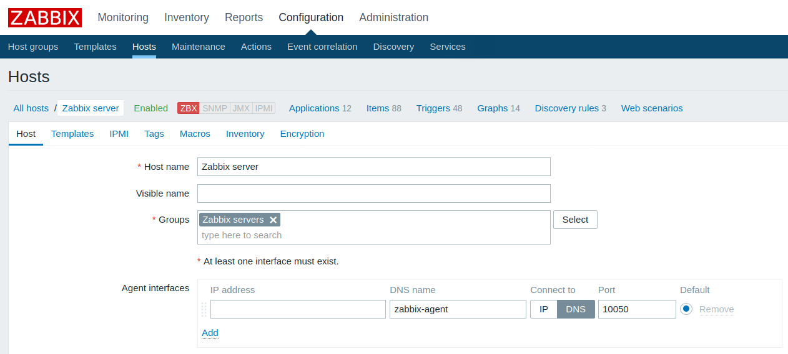
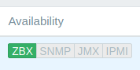
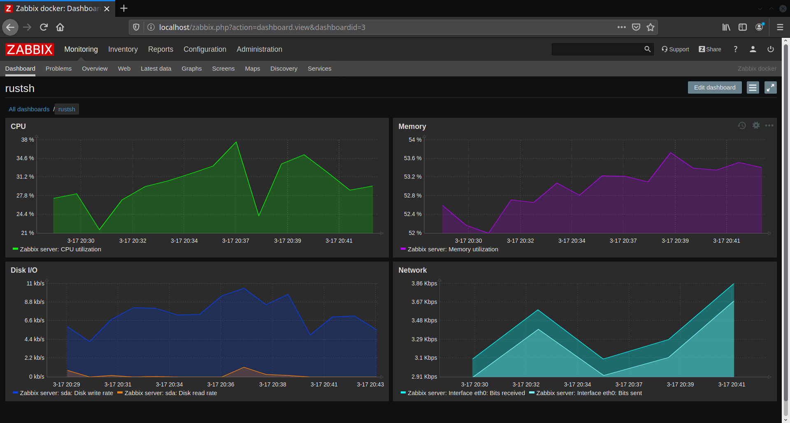

## Домашнее задание к занятию № 13 — «Мониторинг и алертинг»    <!-- omit in toc -->

### Оглавление  <!-- omit in toc -->

- [Задание](#Задание)
- [Требования](#Требования)
- [Описание работы](#Описание-работы)
- [Очистка](#Очистка)

### Задание

Настроить мониторинг на основе Zabbix и дашборд с 4-мя графиками:
- память;
- процессор;
- диск;
- сеть.

Дашборд должен содержать в названии имя исполнителя.

### Требования

Для запуска проекта должны быть установлены Docker и Docker Compose.

### Описание работы

Для работы используется Zabbix. В docker-контейнерах запускаются БД PostgreSQL, сервер и агент Zabbix, а также веб-интерфейс; для связи между ними поднимается docker-сеть. Для управления ими написан файл [docker-compose.yml](docker-compose.yml). Дашборд настроен вручную.

Порядок действий:

1. В каталоге проекта выполнить команду `docker-compose up -d`. Подождать несколько минут, пока контейнеры стартуют.
2. Убедиться, что контейнеры поднялись:

    ```console
    $ docker ps
    CONTAINER ID        IMAGE                                         COMMAND                  CREATED             STATUS              PORTS                                      NAMES
    f05b85d9987f        zabbix/zabbix-agent:alpine-latest             "/sbin/tini -- /usr/…"   11 minutes ago      Up 11 minutes       0.0.0.0:10050->10050/tcp                   zabbix-agent
    a0fad1561ee5        zabbix/zabbix-web-nginx-pgsql:alpine-latest   "docker-entrypoint.sh"   11 minutes ago      Up 11 minutes       0.0.0.0:80->80/tcp, 0.0.0.0:443->443/tcp   zabbix-web
    8c0306e8ecdd        zabbix/zabbix-server-pgsql:alpine-latest      "/sbin/tini -- /usr/…"   12 minutes ago      Up 11 minutes       0.0.0.0:10051->10051/tcp                   zabbix-server
    201a573b24aa        postgres:alpine                               "docker-entrypoint.s…"   12 minutes ago      Up 12 minutes       5432/tcp                                   zabbix-postgres
    ```

3. Открыть в браузере страницу http://localhost/. Должно появиться окно логина в Zabbix. Войти, используя имя пользователя `Admin` и пароль `zabbix`.
4. Сервер Zabbix по умолчанию слушает агента по адресу 127.0.0.1, однако из-за того, что агент находится в другом контейнере, он его не видит. Чтобы исправить это, необходимо перейти на вкладку **Configuration > Hosts**, выбрать **Zabbix server** (единственный доступный хост) и в настройках **Agent interfaces** переключить флаг **Connect to** на `DNS`, а в поле **DNS name** вписать имя сервиса с агентом Zabbix — `zabbix-agent`. Применить изменения, нажав кнопку **Update**.

    

5. Дождаться, пока не установится соединение между агентом и сервером:

    

6. Перейти на вкладку **Monitoring > Dashboard** и создать новый дашборд (тема была изменена на тёмную):

    

### Очистка

Чтобы остановить и удалить все созданные контейнеры и сеть, в каталоге проекта нужно выполнить команду `docker-compose down`.

<br/>

[Вернуться к списку всех ДЗ](../README.md)