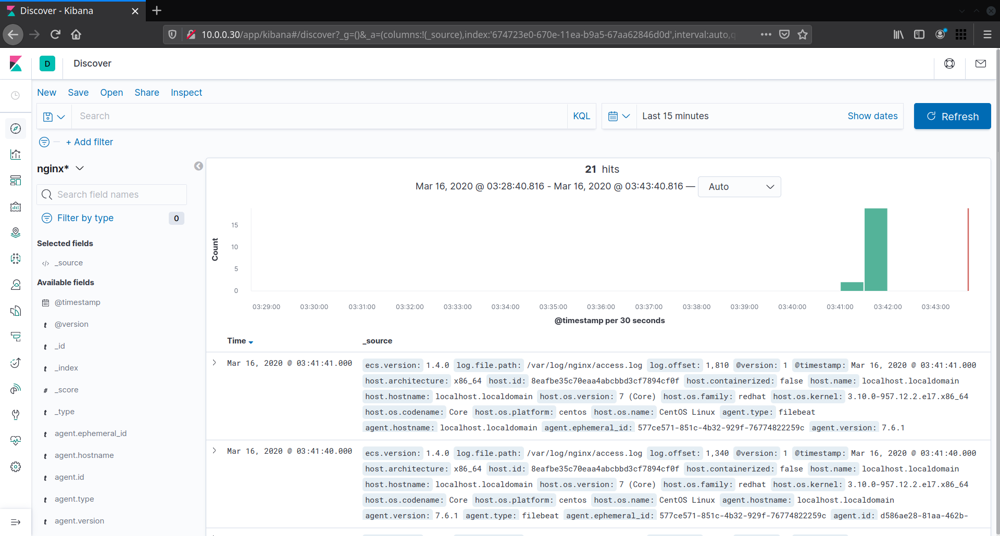

## Домашнее задание к занятию № 16 — «Сбор и анализ логов»    <!-- omit in toc -->

### Оглавление  <!-- omit in toc -->

- [Задание](#Задание)
- [Описание работы](#Описание-работы)
  - [ELK-сервер](#elk-сервер)
  - [Log-сервер](#log-сервер)
  - [Web-сервер](#web-сервер)
- [Проверка работы](#Проверка-работы)
  - [Проверка передачи логов через rsyslog](#Проверка-передачи-логов-через-rsyslog)
  - [Проверка передачи логов Nginx в ELK](#Проверка-передачи-логов-Nginx-в-ELK)

### Задание

Поднять 3 машины: web, log и elk. На web поднять Nginx. На log настроить центральный лог-сервер, используя любую систему на выбор. На elk поднять ELK-стек.

В elk должны уходить только логи Nginx, во вторую систему — всё остальное.

### Описание работы

Для создания машин используется Vagrant ([Vagrantfile](Vagrantfile)), для их конфигурирования — Ansible.

Структура каталога:

```console
$ tree -L 3
.
├── ansible.cfg
├── images
│   └── kibana.png
├── provisioning
│   ├── playbooks
│   │   ├── start_elk.yml
│   │   ├── start_log.yml
│   │   └── start_web.yml
│   └── roles
│       ├── elastic.elasticsearch
│       ├── filebeat
│       ├── java
│       ├── kibana
│       ├── logstash
│       ├── nginx
│       └── rsyslog
├── README.md
└── Vagrantfile
```

#### ELK-сервер

Плейбук по настройке ELK-сервера:

```yml
---
- name: Provision ELK server
  hosts: elk
  vars:
    nginx_version: 1.16.1
    es_version: 7.6.1
    kibana_version: "{{ es_version }}"
    logstash_version: "{{ es_version }}"
  roles:
    - java
    - elastic.elasticsearch
    - kibana
    - nginx
    - logstash
```

1. На сервер устанавливается Java.
2. Устанавливается и запускается Elasticsearch. Для этого используется официальная Ansible-роль от Elastic: https://github.com/elastic/ansible-elasticsearch.

    В рабочий каталог она была установлена командой:

    ```console
    $ ansible-galaxy install elastic.elasticsearch,7.6.1
    ```

    Для уменьшения количества файлов из каталога роли удалены директории test, .ci, .github.

3. Устанавливается и запускается Kibana (той же версии, что и Elasticsearch).
4. Для проксирования Kibana и доступа к ней извне устанавливается Nginx (по умолчанию Kibana слушает только localhost):

    - подключается репозиторий;
    - из него устанавливается и запускается Nginx;
    - устанавливается пакет для управления SELinux из Ansible (libsemanage-python);
    - в SELinux включается правило, разрешающее проксировать запросы;
    - в Nginx настраивается [файл конфигурации](provisioning/roles/nginx/templates/default.conf.j2), перенаправляющий запросы с порта 80 на порт 5601 локального хоста (стандартый порт Kibana), после чего Nginx перезапускается для вступления изменений в силу.

    Для этой же цели достаточно было перенастроить параметр `server.host` в настройках Kibana, однако установка Nginx более приближена к реальной ситуации.

5. Устанавливается и запускается Logstash (той же версии, что и Elasticsearch). В каталог **/etc/logstash/conf.d** копируются [файлы](provisioning/roles/logstash/files) с настройками ввода и вывода данных, а также с фильтрами для парсинга логов Nginx, после чего Logstash перезапускается.

#### Log-сервер

Плейбук по настройке Log-сервера:

```yml
---
- name: Provision log server
  hosts: log
  gather_facts: no
  vars:
    web_host: 10.0.0.10
  roles:
    - rsyslog
```

1. Проверяется, установлен ли на сервере rsyslog.
2. В [файле конфигурации rsyslog](provisioning/roles/rsyslog/templates/server-rsyslog.conf.j2) включается прослушивание порта 514 по протоколам UDP и TCP:

    ```
    # Provides UDP syslog reception
    $ModLoad imudp
    $UDPServerRun 514

    # Provides TCP syslog reception
    $ModLoad imtcp
    $InputTCPServerRun 514
    ```

3. В файл конфигурации rsyslog добавляются правила для сбора и обработки логов с удалённого сервера:

    ```
    $template RemoteLogs,"/var/log/%HOSTNAME%/%PROGRAMNAME%.log"
    *.* ?RemoteLogs
    & ~
    ```

4. Rsyslog перезапускается.

#### Web-сервер

Плейбук по настройке Web-сервера:

```yml
---
- name: Provision web server
  hosts: web
  gather_facts: no
  vars:
    nginx_version: 1.16.1
    filebeat_version: 7.6.1
    log_host: 10.0.0.20
    logstash_host: 10.0.0.30
  roles:
    - nginx
    - rsyslog
    - filebeat
```

1. Подключается репозиторий Nginx, из него устанавливается и запускается сама программа.
2. Проверяется, установлен ли rsyslog.
3. В каталог **/etc/rsyslog.d/** копируется файл [all.conf](provisioning/roles/rsyslog/templates/all.conf.j2), в котором настроена отправка всех логов на удалённый сервер — log. Rsyslog перезапускается.
4. Подключается репозиторий Elasticsearch, из него устанавливается и запускается Filebeat.
5. В каталог **/etc/filebeat** копируется [файл конфигурации](provisioning/roles/filebeat/templates/filebeat.yml.j2) Filebeat, в котором настроен сбор логов Nginx и отправка их в Logstash. Filebeat перезапускается.

### Проверка работы

Чтобы создать и сконфигурировать все машины, достаточно выполнить команду `vagrant up`.

#### Проверка передачи логов через rsyslog

1. Зайти на машину log, выполнив команду `vagrant ssh log`.
2. Убедиться, что в каталоге **/var/log** создана директория с названием, соответствующим имени хоста web-сервера (задаётся в Vagrantfile, в данной работе это **web-server**):

    ```console
    [vagrant@localhost ~]$ ls -l /var/log
    total 144
    ...
    drwx------. 2 root   root      188 Mar 16 19:19 web-server
    ...
    ```

3. Убедиться, что в этой директории созданы файлы с логами различных программ, а также проверить содержимое этих файлов:

    ```console
    [vagrant@localhost log]$ sudo ls -l /var/log/web-server/
    total 56
    -rw-------. 1 root root   199 Mar 16 19:19 ansible-systemd.log
    -rw-------. 1 root root   142 Mar 16 19:22 chronyd.log
    -rw-------. 1 root root 20895 Mar 16 19:26 filebeat.log
    -rw-------. 1 root root   717 Mar 16 19:19 polkitd.log
    -rw-------. 1 root root   302 Mar 16 19:19 rsyslogd.log
    -rw-------. 1 root root   465 Mar 16 19:20 sshd.log
    -rw-------. 1 root root   547 Mar 16 19:19 sudo.log
    -rw-------. 1 root root   690 Mar 16 19:20 systemd.log
    -rw-------. 1 root root   124 Mar 16 19:20 systemd-logind.log

    [vagrant@localhost ~]$ sudo tail /var/log/10.0.0.10/systemd-logind.log
    Mar 16 19:19:45 web-server systemd-logind: Removed session 2.
    Mar 16 19:20:45 web-server systemd-logind: Removed session 4.
    ```

#### Проверка передачи логов Nginx в ELK

1. Открыть в браузере страницу с IP-адресом web-сервера — http://10.0.0.10/. Несколько раз обновить её, чтобы получить больше access-логов. Чтобы получить логи с ошибками, перейти на заведомо несуществующую страницу, например, http://10.0.0.10/blank.
2. Открыть в браузере страницу с IP-адресом elk-сервера — http://10.0.0.30/. Убедиться, что Kibana работает.
3. На странице с настройками Kibana создать шаблон `nginx*`.
4. Перейти на вкладку Discover и убедиться, что логи Nginx отображаются:

    

<br/>

[Вернуться к списку всех ДЗ](../README.md)