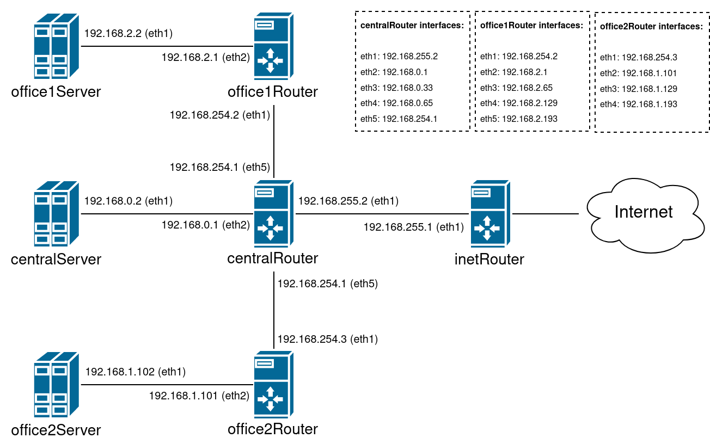

## Домашнее задание к занятию № 18 — «Архитектура сетей»    <!-- omit in toc -->

### Оглавление  <!-- omit in toc -->

- [Задание](#Задание)
- [Описание работы](#Описание-работы)
- [Проверка работы](#Проверка-работы)
- [Теоретическая часть](#Теоретическая-часть)
  - [Подсети](#Подсети)
  - [Ошибки при разбиении](#Ошибки-при-разбиении)

### Задание

#### Дано  <!-- omit in toc -->

По ссылке https://github.com/erlong15/otus-linux/tree/network (ветка network) находится Vagrantfile с начальным построением сети:
- inetRouter;
- centralRouter;
- centralServer.

#### Планируемая архитектура  <!-- omit in toc -->

Необходимо построить следующую архитектуру.

Сеть office1:
- 192.168.2.0/26 — dev;
- 192.168.2.64/26 — test servers;
- 192.168.2.128/26 — managers;
- 192.168.2.192/26 — office hardware.

Сеть office2:
- 192.168.1.0/25 — dev;
- 192.168.1.128/26 — test servers;
- 192.168.1.192/26 — office hardware.

Сеть central:
- 192.168.0.0/28 — directors;
- 192.168.0.32/28 — office hardware;
- 192.168.0.64/26 — wifi.

```
Office1 ---\
            ---> Central ---> IRouter ---> Internet
Office2 ---/
```

Таким образом, должны получиться следующие серверы:
- inetRouter;
- centralRouter;
- office1Router;
- office2Router;
- centralServer;
- office1Server;
- office2Server.

#### Теоретическая часть  <!-- omit in toc -->

- Найти свободные подсети.
- Посчитать, сколько узлов в каждой подсети, включая свободные.
- Указать broadcast-адрес для каждой подсети.
- Проверить, нет ли ошибок при разбиении.

#### Практическая часть  <!-- omit in toc -->

- Соединить офисы в сеть согласно схеме и настроить роутинг.
- Все серверы и роутеры должны ходить в интернет через inetRouter.
- Все серверы должны видеть друг друга.
- У всех новых серверов отключить дефолт на NAT (eth0), который Vagrant поднимает для связи.

### Описание работы

Для создания хостов используется Vagrant. В [Vagrantfile](Vagrantfile) описано создание интерфейсов с нужными сетевыми настройками. Для конфигурирования используется Ansible.

[Плейбук](provisioning/start.yml) для предварительной настройки:

```yml
---
- name: Config routing
  hosts: all
  roles:
    - route
```

Структура роли [route](provisioning/roles/route):

```
route/
├── defaults
│   └── main.yml
├── files
│   └── forwarding.conf
├── handlers
│   └── main.yml
├── tasks
│   ├── default_route.yml
│   ├── iptables.yml
│   ├── main.yml
│   └── no_nm.yml
└── templates
    ├── centralRouter
    │   ├── route-eth1.j2
    │   └── route-eth5.j2
    ├── centralServer
    │   └── route-eth1.j2
    ├── inetRouter
    │   └── route-eth1.j2
    ├── office1Router
    │   └── route-eth1.j2
    ├── office1Server
    │   └── route-eth1.j2
    ├── office2Router
    │   └── route-eth1.j2
    ├── office2Server
    │   └── route-eth1.j2
    └── network.j2
```

При запуске плейбука [start.yml](provisioning/start.yml) выполняются следующие шаги:

1. Устанавливается tcpdump.
2. На хосте inetRouter настраивается iptables:

   - устанавливается пакет iptables-services;
   - запускается сервис iptables;
   - добавляется правило для маскарадинга исходящих пакетов:

        ```console
        iptables -t nat -A POSTROUTING ! -d 192.168.0.0/16 -o eth0 -j MASQUERADE
        ```

   - удаляются все правила из таблицы filter:

        ```console
        iptables -F
        ```

   - конфигурация iptables сохраняется для работы после перезагрузки сервера:

        ```console
        service iptables save
        ```

3. В директорию **/etc/sysconfig** копируется файл [network](provisioning/roles/route/templates/network.j2), в котором:

   - явно указано использование сети:

        ```ini
        NETWORKING=yes
        ```

   - указано имя хоста (специфично для каждого сервера):

        ```ini
        HOSTNAME=inetRouter
        ```

   - отключаются маршруты ZEROCONF (маршруты для сети 169.254.0.0/16):

        ```ini
        NOZEROCONF=yes
        ```

4. На роутерах включается форвардинг пакетов: в каталог **/etc/sysctl.d** добавляется файл [forwarding.conf](provisioning/roles/route/files/forwarding.conf), содержащий следующую строку:

    ```ini
    net.ipv4.conf.all.forwarding = 1
    ```

5. На всех хостах, кроме inetRouter, на интерфейсе `eth0` отключается маршрут default: выполняется команда `ip route del default`, в файл **/etc/sysconfig/network-scripts/ifcfg-eth0** добавляется параметр `DEFROUTE=no`.
6. На всех хостах, кроме inetRouter, на интерфейсе `eth1` назначается шлюз: в файл **/etc/sysconfig/network-scripts/ifcfg-eth1** добавляется параметр вида `GATEWAY=192.168.0.1`. Адреса шлюзов для каждой сети и для каждого хоста прописаны в файле [defaults/main.yml](provisioning/roles/route/defaults/main.yml) роли [route](provisioning/roles/route).
7. Настраивается маршрутизация:

   - на каждый хост в каталог **/etc/sysconfig/network-scripts** копируется файл **route-eth1** с прописанными в нём маршрутами:

     - на всех хостах, кроме inetRouter, в файле **route-eth1** прописан только маршрут по умочанию до вышестоящего роутера, то есть строка вида:

        ```
        default via 192.168.0.1
        ```

     - на хосте inetRouter в файле **route-eth1** прописаны маршруты до внутренних сетей через centralRouter:

        ```
        192.168.254.0/28 via 192.168.255.2
        192.168.0.0/28 via 192.168.255.2
        192.168.2.0/26 via 192.168.255.2
        192.168.1.0/25 via 192.168.255.2
        ```

   - на хост centralRouter дополнительно копируется файл **route-eth5**, так как он связан с офисными роутерами через интерфейс `eth5`. В файле прописаны маршруты до сетей office1 и office2 через офисные роутеры:

        ```
        192.168.2.0/26 via 192.168.254.2
        192.168.1.0/25 via 192.168.254.3
        ```

8. После поднятия хостов сервис network находится в статусе `failed` c ошибкой `Connection activation failed: No suitable device found for this connection` для интерфейса `eth0` из-за NetworkManager. При выполнении команды `systemctl restart network` сервис network запускается, но маршруты из файлов **route-eth\*** не подтягиваются. Чтобы избежать этого, сервиc network запускается отдельной командой (после чего рестарт работает нормально).
9. Отключается сервис NetworkManager, так как, во-первых, сеть настраивается вручную, а во-вторых, он приводит к ошибке, описанной в предыдущем пункте (ошибка повторяется при перезагрузке сервера). Кроме того, во всех файлах **/etc/sysconfig/network-scripts/ifcfg-eth\*** указывается параметр `NM_CONTROLLED=no`, отключающий управление интерфейсом посредством NetworkManagarer.

10. После внесения всех изменений перезапускается сервис network.

Итоговая конфигурация выглядит следующим образом:



### Проверка работы

Чтобы создать и сконфигурировать все машины и сеть, достаточно выполнить команду `vagrant up`.

1. Проверим настройку маршрутизации:

    На centralServer:

    ```console
    [vagrant@centralServer ~]$ ip r
    default via 192.168.0.1 dev eth1 
    10.0.2.0/24 dev eth0 proto kernel scope link src 10.0.2.15 
    192.168.0.0/28 dev eth1 proto kernel scope link src 192.168.0.2
    ```

    На centralRouter:

    ```console
    [vagrant@centralRouter ~]$ ip r
    default via 192.168.255.1 dev eth1 
    10.0.2.0/24 dev eth0 proto kernel scope link src 10.0.2.15 
    192.168.0.0/28 dev eth2 proto kernel scope link src 192.168.0.1 
    192.168.0.32/28 dev eth3 proto kernel scope link src 192.168.0.33 
    192.168.0.64/26 dev eth4 proto kernel scope link src 192.168.0.65 
    192.168.1.0/25 via 192.168.254.3 dev eth5 
    192.168.2.0/26 via 192.168.254.2 dev eth5 
    192.168.254.0/28 dev eth5 proto kernel scope link src 192.168.254.1 
    192.168.255.0/30 dev eth1 proto kernel scope link src 192.168.255.2
    ```

    На inetRouter:

    ```console
    [vagrant@inetRouter ~]$ ip r
    default via 10.0.2.2 dev eth0 
    10.0.2.0/24 dev eth0 proto kernel scope link src 10.0.2.15 
    192.168.0.0/28 via 192.168.255.2 dev eth1 
    192.168.1.0/25 via 192.168.255.2 dev eth1 
    192.168.2.0/26 via 192.168.255.2 dev eth1 
    192.168.254.0/28 via 192.168.255.2 dev eth1 
    192.168.255.0/30 dev eth1 proto kernel scope link src 192.168.255.1
    ```

2. Проверим, что узлы сети видят друг друга.

    Ping от office2Server до centralServer:

    ```console
    [vagrant@office2Server ~]$ ping -c4 192.168.255.2
    PING 192.168.255.2 (192.168.255.2) 56(84) bytes of data.
    64 bytes from 192.168.255.2: icmp_seq=1 ttl=63 time=1.43 ms
    64 bytes from 192.168.255.2: icmp_seq=2 ttl=63 time=1.65 ms
    64 bytes from 192.168.255.2: icmp_seq=3 ttl=63 time=1.56 ms
    64 bytes from 192.168.255.2: icmp_seq=4 ttl=63 time=1.40 ms

    --- 192.168.255.2 ping statistics ---
    4 packets transmitted, 4 received, 0% packet loss, time 3006ms
    rtt min/avg/max/mdev = 1.404/1.515/1.655/0.111 ms
    ```

    Ping от inetRouter до office1Router:

    ```console
    [vagrant@inetRouter ~]$ ping -c4 192.168.254.2
    PING 192.168.254.2 (192.168.254.2) 56(84) bytes of data.
    64 bytes from 192.168.254.2: icmp_seq=1 ttl=63 time=5.87 ms
    64 bytes from 192.168.254.2: icmp_seq=2 ttl=63 time=1.66 ms
    64 bytes from 192.168.254.2: icmp_seq=3 ttl=63 time=1.60 ms
    64 bytes from 192.168.254.2: icmp_seq=4 ttl=63 time=1.69 ms

    --- 192.168.254.2 ping statistics ---
    4 packets transmitted, 4 received, 0% packet loss, time 3005ms
    rtt min/avg/max/mdev = 1.602/2.708/5.873/1.827 ms
    ```

3. Проверим, что серверы имеют доступ в интернет через inetRouter.

    Для этого откроем в разных терминалах inetRouter и любой другой узел, например, office1Server.

    На inetRouter запустим tcpdump (если не указать интерфейс, то по умолчанию будет использован интерфейс с минимальным номером, то есть `eth0`):
    
    ```console
    [vagrant@inetRouter ~]$ sudo tcpdump -nnt -i any host 192.168.2.2
    tcpdump: verbose output suppressed, use -v or -vv for full protocol decode
    listening on any, link-type LINUX_SLL (Linux cooked), capture size 262144 bytes
    ```

    На втором хосте запросим интернет-страницу:

    ```console
    [vagrant@office1Server ~]$ curl -L google.com
    ```

    Проверим вывод tcpdump на inetRouter:

    ```console
    IP 192.168.2.2.33102 > 64.233.164.102.80: Flags [S], seq 1472322177, win 29200, options [mss 1460,sackOK,TS val 1186370 ecr 0,nop,wscale 6], length 0
    IP 64.233.164.102.80 > 192.168.2.2.33102: Flags [S.], seq 246400001, ack 1472322178, win 65535, options [mss 1460], length 0
    IP 192.168.2.2.33102 > 64.233.164.102.80: Flags [.], ack 1, win 29200, length 0
    IP 192.168.2.2.33102 > 64.233.164.102.80: Flags [P.], seq 1:75, ack 1, win 29200, length 74: HTTP: GET / HTTP/1.1
    IP 64.233.164.102.80 > 192.168.2.2.33102: Flags [.], ack 75, win 65535, length 0
    IP 64.233.164.102.80 > 192.168.2.2.33102: Flags [P.], seq 1:529, ack 75, win 65535, length 528: HTTP: HTTP/1.1 301 Moved Permanently
    IP 192.168.2.2.33102 > 64.233.164.102.80: Flags [.], ack 529, win 30016, length 0
    IP 192.168.2.2.48338 > 64.233.162.106.80: Flags [S], seq 2533686022, win 29200, options [mss 1460,sackOK,TS val 1186522 ecr 0,nop,wscale 6], length 0
    IP 64.233.162.106.80 > 192.168.2.2.48338: Flags [S.], seq 246464001, ack 2533686023, win 65535, options [mss 1460], length 0
    IP 192.168.2.2.48338 > 64.233.162.106.80: Flags [.], ack 1, win 29200, length 0
    IP 192.168.2.2.48338 > 64.233.162.106.80: Flags [P.], seq 1:79, ack 1, win 29200, length 78: HTTP: GET / HTTP/1.1
    IP 64.233.162.106.80 > 192.168.2.2.48338: Flags [.], ack 79, win 65535, length 0
    IP 64.233.162.106.80 > 192.168.2.2.48338: Flags [.], seq 1:2841, ack 79, win 65535, length 2840: HTTP: HTTP/1.1 200 OK
    ...
    ``` 

    Другой способ: выключить inetRouter (например, выполнив на хостовой машине команду `vagrant suspend inetRouter`) и проверить доступ к интернету на любом узле:

    ```console
    [vagrant@office1Server ~]$ ping -c4 google.com
    PING google.com (64.233.164.139) 56(84) bytes of data.

    --- google.com ping statistics ---
    4 packets transmitted, 0 received, 100% packet loss, time 2999ms
    ```

    После запуска inetRouter (команда `vagrant resume inetRouter`):

    ```console
    [vagrant@office1Server ~]$ ping -c4 google.com
    PING google.com (64.233.164.101) 56(84) bytes of data.
    64 bytes from google.com (64.233.164.101): icmp_seq=1 ttl=57 time=715 ms
    64 bytes from google.com (64.233.164.101): icmp_seq=2 ttl=57 time=88.7 ms
    64 bytes from google.com (64.233.164.101): icmp_seq=3 ttl=57 time=70.7 ms
    64 bytes from google.com (64.233.164.101): icmp_seq=4 ttl=57 time=70.2 ms

    --- google.com ping statistics ---
    4 packets transmitted, 4 received, 0% packet loss, time 3002ms
    rtt min/avg/max/mdev = 70.203/236.340/715.600/276.801 ms
    ```

### Теоретическая часть

#### Подсети

##### Сеть central  <!-- omit in toc -->

Существующие подсети:

- 192.168.0.0/28 — directors
  - количество хостов: 14
  - broadcast: 192.168.0.15

- 192.168.0.32/28 — office hardware
  - количество хостов: 14
  - broadcast: 192.168.0.47

- 192.168.0.64/26 — wifi
  - количество хостов: 62
  - broadcast: 192.168.0.127

Свободные подсети:

- 192.168.0.16/28
  - количество хостов: 14
  - broadcast: 192.168.0.31

- 192.168.0.48/28
  - количество хостов: 14
  - broadcast: 192.168.0.63

- 192.168.0.128/25
  - количество хостов: 126
  - broadcast: 192.168.0.255

##### Сеть office1  <!-- omit in toc -->

Существующие подсети:

- 192.168.2.0/26 — dev
  - количество хостов: 62
  - broadcast: 192.168.2.63

- 192.168.2.64/26 — test servers
  - количество хостов: 62
  - broadcast: 192.168.2.127

- 192.168.2.128/26 — managers
  - количество хостов: 62
  - broadcast: 192.168.2.191

- 192.168.2.192/26 — office hardware
  - количество хостов: 62
  - broadcast: 192.168.2.255

Свободных подсетей нет.

##### Сеть office2  <!-- omit in toc -->

Существующие подсети:

- 192.168.1.0/25 — dev
  - количество хостов: 126
  - broadcast: 192.168.1.127

- 192.168.1.128/26 — test servers
  - количество хостов: 62
  - broadcast: 192.168.1.191

- 192.168.1.192/26 — office hardware
  - количество хостов: 62
  - broadcast: 192.168.1.255

Свободных подсетей нет.

##### Сеть для объединения офисных роутеров  <!-- omit in toc -->

Существующая подсеть:

- 192.168.254.0/28 — router-lan
  - количество хостов: 14
  - broadcast: 192.168.254.15

Свободные подсети:

- 192.168.254.16/28
  - количество хостов: 14
  - broadcast: 192.168.254.31

- 192.168.254.32/27
  - количество хостов: 30
  - broadcast: 192.168.254.63

- 192.168.254.64/26
  - количество хостов: 62
  - broadcast: 192.168.254.127

- 192.168.254.128/25
  - количество хостов: 126
  - broadcast: 192.168.254.255

##### Сеть для объединения centralRouter и inetRouter  <!-- omit in toc -->

Существующая подсеть:

- 192.168.255.0/30  — router-www
  - количество хостов: 2
  - broadcast: 192.168.255.3

Свободные подсети:

- 192.168.255.4/30
  - количество хостов: 2
  - broadcast: 192.168.255.7

- 192.168.255.8/29
  - количество хостов: 6
  - broadcast: 192.168.255.15

- 192.168.255.16/28
  - количество хостов: 14
  - broadcast: 192.168.255.31

- 192.168.255.32/27
  - количество хостов: 30
  - broadcast: 192.168.255.63

- 192.168.255.64/26
  - количество хостов: 62
  - broadcast: 192.168.255.127

- 192.168.255.128/25
  - количество хостов: 126
  - broadcast: 192.168.255.255

#### Ошибки при разбиении

В сети central для подсети office hardware следует выделить диапазон 192.168.0.16/28 (а не 192.168.0.32/28) — тогда будет доступен более крупный сегмент 192.168.0.32/27.

<br/>

[Вернуться к списку всех ДЗ](../README.md)
