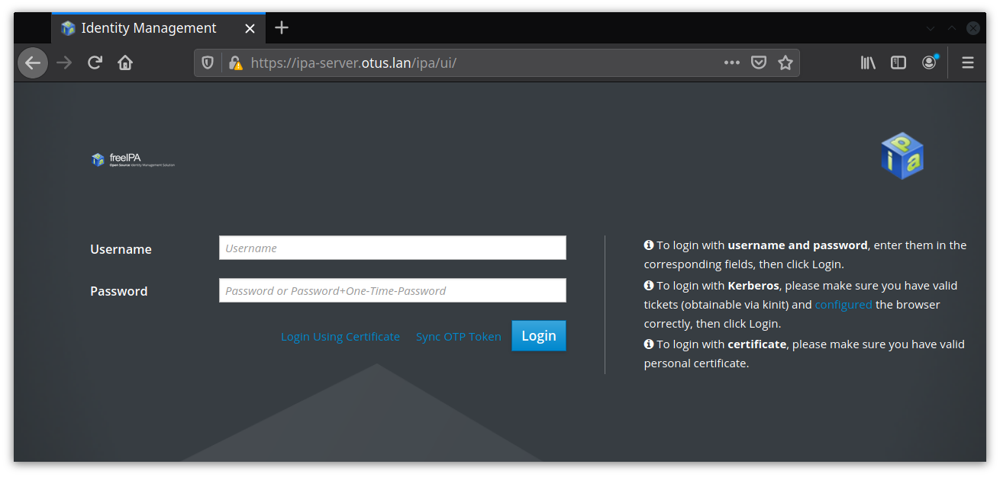
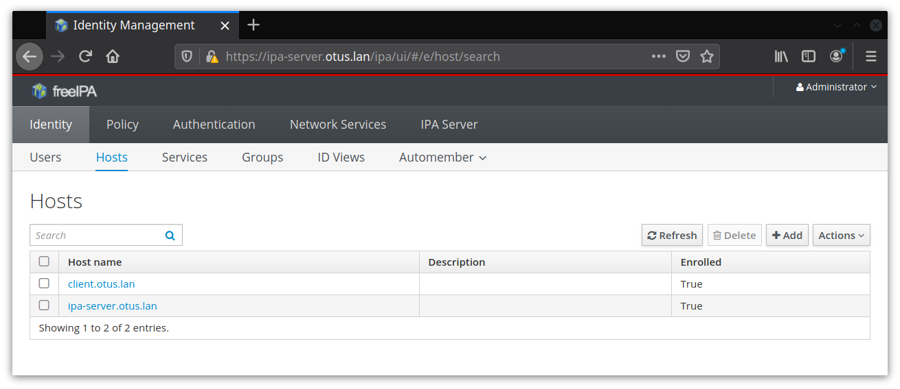
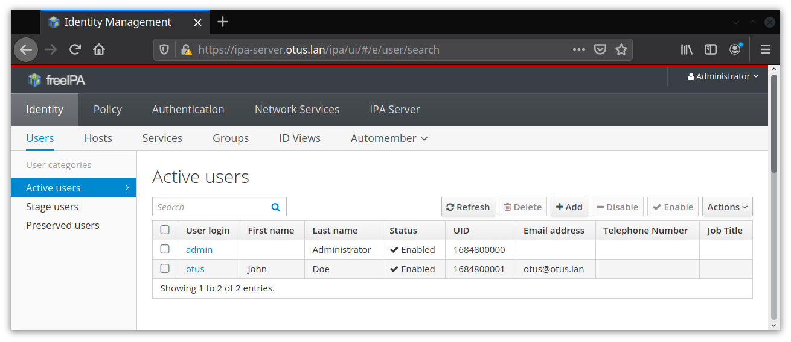
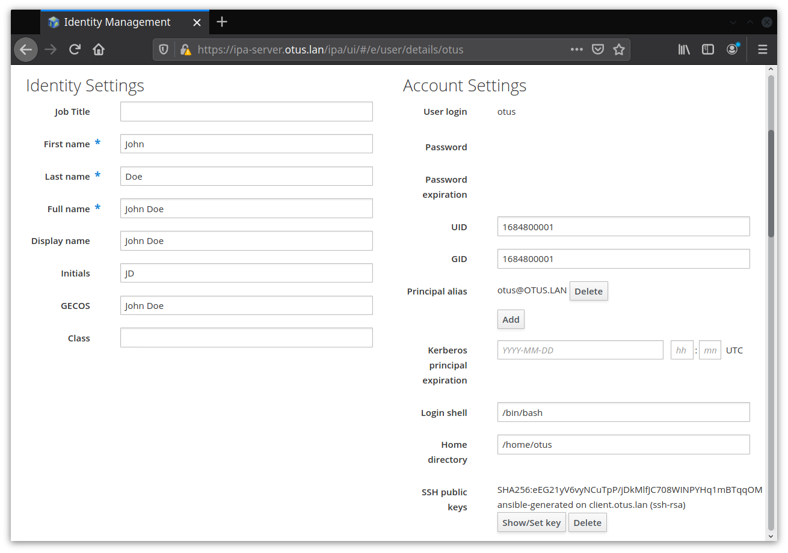

## Домашнее задание к занятию № 19 — «LDAP. Централизованная авторизация и аутентификация»    <!-- omit in toc -->

### Оглавление  <!-- omit in toc -->

- [Задание](#Задание)
- [Описание работы](#Описание-работы)
  - [Настройка сервера](#Настройка-сервера)
  - [Настройка клиента](#Настройка-клиента)
  - [Добавление пользователя](#Добавление-пользователя)
- [Проверка работы](#Проверка-работы)
  - [Проверка работы файрвола](#Проверка-работы-файрвола)
  - [Проверка настройки хостов](#Проверка-настройки-хостов)
  - [Проверка подключения пользователя по SSH](#Проверка-подключения-пользователя-по-ssh)
  - [Проверка работы FreeIPA в веб-интерфейсе](#Проверка-работы-freeipa-в-веб-интерфейсе)

### Задание

1. Установить FreeIPA.
2. Написать Ansible-плейбук для конфигурации клиента.
3. Настроить аутентификацию по SSH-ключам. (*)
4. Файрвол должен быть включён на сервере и на клиенте. (**)

### Описание работы

При выполнении команды `vagrant up` поднимаются две виртуальные машины — server и client ([Vagrantfile](Vagrantfile)), которые конфигурируются при помощи Ansible. Хостовые имена сразу задаются в виде FQDN (`ipa-server.otus.lan` и `client.otus.lan` соответственно).

Структура каталога:

```console
$ tree -L 3
.
├── ansible.cfg
├── images
│   ├── hosts.png
│   ├── login.png
│   ├── otus.png
│   └── users.png
├── provisioning
│   ├── playbooks
│   │   ├── start-client.yml
│   │   └── start-server.yml
│   └── roles
│       ├── ipa-client
│       ├── ipa-server
│       └── ipa-user-add
├── README.md
└── Vagrantfile
```

#### Настройка сервера

Плейбук для настройки сервера:

```yml
---
- name: Provision IPA server
  hosts: server
  gather_facts: yes
  roles:
    - role: ipa-server
      vars:
        - dm_password: dmpassword
        - admin_password: adminpassword
```

1. Включается и конфигурируется файрвол: добавляются нужные для работы сервисы (ntp, http, https, ldap, ldaps, kerberos, kpasswd, dns, freeipa-ldap, freeipa-ldaps), после чего он перезапускается.
2. При помощи утилиты authconfig в PAM добавляется правило для создания домашнего каталога при подключении по SSH:

    ```console
    authconfig --enablemkhomedir --update
    ```

3. В файл **/etc/hosts** добавляется строчка:

    ```
    192.168.33.10   ipa-server.otus.lan     ipa-server
    ```

    IP-адрес и доменное имя задаются в Vagrantfile, а Ansible берёт их из собранных фактов.

4. Устанавливаются пакеты `ipa-server` и `ipa-server-dns`, а также обновляется пакет `nss` (без этого установка сервера IPA падает с ошибкой).
5. В пакетном (неинтерактивном) режиме (т. е. с ключом `--unattended`) выполняется команда `ipa-server-install`. Все переменные для настройки задаются в файле [defaults/main.yml](provisioning/roles/ipa-server/defaults/main.yml) Ansible-роли [ipa-server](provisioning/roles/ipa-server), при этом пароли могут быть переопределены в плейбуке [start-server.yml](provisioning/playbooks/start-server.yml).

    Также при установке используется ключ вида `--subject-base="O=OTUS.LAN 1585658548"`, где `1585658548` — временная метка. Без этого при удалении и новой установке сервера IPA будет создан другой сертификат с тем же именем, что приведёт к ошибке `SEC_ERROR_REUSED_ISSUER_AND_SERIAL` при попытке повторно зайти в веб-интерфейс через браузер после переустановки сервера.

#### Настройка клиента

Плейбук для настройки клиента и добавления пользователя:

```yml
---
- name: Provision IPA client
  hosts: client
  gather_facts: yes
  vars:
    - admin_password: adminpassword
    - server_ip: 192.168.33.10
  roles:
    - role: ipa-client
    - role: ipa-user-add
      vars:
        - user_login: otus
        - user_name: John
        - user_surname: Doe
```

1. Включается файрвол.
2. При помощи утилиты authconfig в PAM добавляется правило для создания домашнего каталога при подключении по SSH:

    ```console
    authconfig --enablemkhomedir --update
    ```

3. Файл **/etc/resolv.conf** приводится к виду:

    ```
    nameserver 192.163.33.10
    domain otus.lan
    ```

    IP — адрес сервера, задаётся в переменной в [defaults/main.yml](provisioning/roles/ipa-client/defaults/main.yml) Ansible-роли [ipa-client](provisioning/roles/ipa-client) и может быть переопределён в плейбуке [start-client.yml](provisioning/playbooks/start-client.yml). Доменное имя Ansible берёт из собранных фактов.

4. Устанавливается пакет `ipa-client`.
5. В пакетном (неинтерактивном) режиме (т. е. с ключом `--unattended`) выполняется команда `ipa-client-install`. Пароль для пользователя admin задаётся в файле [defaults/main.yml](provisioning/roles/ipa-client/defaults/main.yml) Ansible-роли [ipa-client](provisioning/roles/ipa-client) и может быть переопределён в плейбуке [start-client.yml](provisioning/playbooks/start-client.yml) в соответствии с паролем, заданным для этого пользователя при установке сервера.

#### Добавление пользователя

Для добавления пользователя используется роль [ipa-user-add](provisioning/roles/ipa-user-add).

1. На клиенте создаётся пользователь otus без пароля, для него генерируется пара SSH-ключей.
2. Запрашивается тикет Kerberos для пользователя admin:

    ```console
    echo -n adminpassword | kinit admin
    ```

3. Выполняется команда `ipa user-add` для добавления пользователя otus в домен. Для того, чтобы скопировать его публичный SSH-ключ на сервер IPA, используется ключ `--sshpubkey="$(cat /home/otus/.ssh/id_rsa.pub)"`.

### Проверка работы

Чтобы создать и сконфигурировать все машины, достаточно выполнить команду `vagrant up`.

#### Проверка работы файрвола

1. Подключиться к серверу:

    ```console
    $ vagrant ssh server
    ```

2. Залогиниться под пользователем root:

    ```console
    [vagrant@ipa-server ~]$ sudo -i
    ```

3. Убедиться, что файрвол работает:

    ```console
    [root@ipa-server ~]# firewall-cmd --state
    running
    ```

4. Проверить, какие службы добавлены в правила файрвола:

    ```console
    [root@ipa-server ~]# firewall-cmd --list-services 
    ssh dhcpv6-client ntp http https ldap ldaps kerberos kpasswd dns freeipa-ldap freeipa-ldaps
    ```

#### Проверка настройки хостов

1. Подключиться к клиенту:

    ```console
    $ vagrant ssh client
    ```

2. Залогиниться под пользователем root:

    ```console
    [vagrant@client ~]$ sudo -i
    ```

3. Проверить список тикетов в кэше:

    ```console
    [root@client ~]# klist
    Ticket cache: KEYRING:persistent:0:0
    Default principal: admin@OTUS.LAN

    Valid starting       Expires              Service principal
    03/31/2020 12:19:55  04/01/2020 12:19:55  HTTP/ipa-server.otus.lan@OTUS.LAN
    03/31/2020 12:19:55  04/01/2020 12:19:55  krbtgt/OTUS.LAN@OTUS.LAN
    ```

4. Просмотреть информацию о пользователях:

    ```console
    [root@client ~]# ipa user-find
    ---------------
    2 users matched
    ---------------
    User login: admin
    Last name: Administrator
    Home directory: /home/admin
    Login shell: /bin/bash
    Principal alias: admin@OTUS.LAN
    UID: 1684800000
    GID: 1684800000
    Account disabled: False

    User login: otus
    First name: John
    Last name: Doe
    Home directory: /home/otus
    Login shell: /bin/bash
    Principal name: otus@OTUS.LAN
    Principal alias: otus@OTUS.LAN
    Email address: otus@otus.lan
    UID: 1684800001
    GID: 1684800001
    SSH public key fingerprint: SHA256:eEG21yV6vyNCuTpP/jDkMlfJC708WINPYHq1mBTqqOM ansible-generated on client.otus.lan (ssh-rsa)
    Account disabled: False
    ----------------------------
    Number of entries returned 2
    ----------------------------
    ```

#### Проверка подключения пользователя по SSH

1. Подключиться к клиенту:

    ```console
    $ vagrant ssh client
    ```

2. Залогиниться под пользователем otus:

    ```console
    [vagrant@client ~]$ sudo su - otus
    ```

3. Подключиться к серверу по SSH:

    ```console
    [otus@client ~]$ ssh otus@192.168.33.10
    The authenticity of host '192.168.33.10 (<no hostip for proxy command>)' can't be established.
    ECDSA key fingerprint is SHA256:hTXj1eCNZrGackN6eM3II5YV/iWzuqcFNs/7RxYnPOM.
    ECDSA key fingerprint is MD5:bc:a5:b1:1f:dd:70:50:9a:9d:ec:b6:b8:ba:ea:48:ee.
    Are you sure you want to continue connecting (yes/no)? yes
    Warning: Permanently added '192.168.33.10' (ECDSA) to the list of known hosts.
    Creating home directory for otus.
    [otus@ipa-server ~]$ hostname
    ipa-server.otus.lan 
    ```

    Подключение прошло успешно, хотя публичный ключ не был скопирован на хост обычными средствами (например, при помощи команды `ssh-copy-id`). Также на сервере при подключении был создан домашний каталог для пользователя otus:

    ```console
    [otus@ipa-server ~]$ pwd
    /home/otus
    ```

#### Проверка работы FreeIPA в веб-интерфейсе

1. На локальной машине добавить в файл **/etc/hosts** строку:

```
192.168.33.10 ipa-server.otus.lan
```

2. В браузере перейти на страницу http://192.168.33.10/. Должен произойти редирект на https://ipa-server.otus.lan/ipa/ui/ со страницей для входа во FreeIPA:

    

3. Залогиниться, используя имя и пароль администратора (в данной работе это `admin` и `adminpassword`).
4. На вкладке Hosts проверить, какие хосты включены в домен. Убедиться, что в списке есть client.otus.lan:

    

5. На вкладке Users проверить, какие пользователи включены в домен. Убедиться, что в списке есть otus:

    

6. Перейти в настройки пользователя otus и проверить информацию о нём:

    

<br/>

[Вернуться к списку всех ДЗ](../README.md)