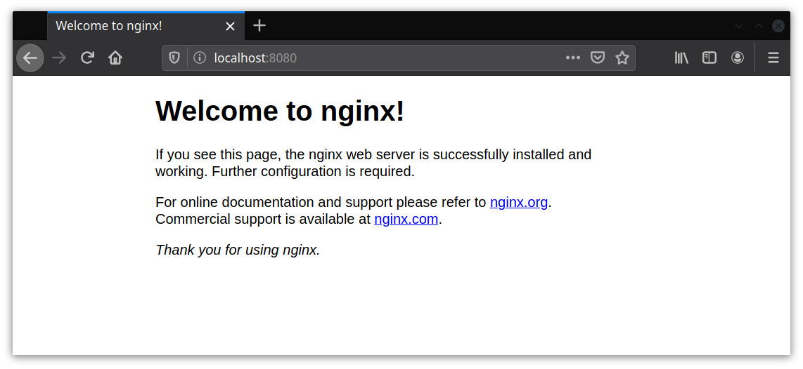

## Домашнее задание к занятию № 20 — «Фильтрация трафика»  <!-- omit in toc -->

### Оглавление  <!-- omit in toc -->

- [Задание](#Задание)
- [Описание работы](#Описание-работы)
  - [Подготовка стенда](#Подготовка-стенда)
  - [Knocking Port](#knocking-port)
  - [Проброс портов](#Проброс-портов)
- [Проверка работы](#Проверка-работы)
  - [Проверка Knocking Port](#Проверка-knocking-port)
  - [Проверка проброса портов](#Проверка-проброса-портов)

### Задание

1. Реализовать Knocking Port — centralRouter может попасть на inetRouter по SSH через knock-скрипт.
2. Добавить inetRouter2, который доступен с хостовой машины (например, через localhost).
3. Запустить Nginx на centralServer.
4. Пробросить порт 80 centralServer на порт 8080 inetRouter2.
5. Доступ в интернет оставить через inetRouter.

Задание со звёздочкой: реализовать проход на 80-й порт без маскарадинга.

### Описание работы

#### Подготовка стенда

В работе используется стенд из [домашней работы «Архитектура сетей»](../hw-19) со следующими изменениями:

1. Удалены все лишние серверы и сети.
2. Добавлен сервер inetRouter2, порт 8080 которого проброшен на порт 8080 хостовой машины. Сеть для связи между роутерами расширена с двух хостов до шести. Доступ в интернет осуществляется через inetRouter, как и на остальных хостах.
3. Адрес шлюза указан в файле **/etc/sysconfig/network**, все лишние файлы **route-eth\*** удалены.

#### Knocking Port

Для включения Knocking Port созданы роли:
- [knock_server](provisioning/roles/knock_server) — для конфигурирования сервера (куда нужен доступ);
- [knock_client](provisioning/roles/knock_client) — для конфигурирования клиента (откуда нужен доступ).

##### Настойка сервера  <!-- omit in toc -->

Сервером выступает inetRouter.

1. Проверяется, установлен ли пакет iptables-service (так как он устанавливается при настройке маскарадинга в роли [route](provisioning/roles/route), шаг пропускается).
2. Проверяется, запущен ли сервис iptables (аналогично предыдущему пункту).
3. В каталог **/etc/sysconfig** копируется файл [iptables](provisioning/roles/knock_server/templates/iptables.j2) с правилами файрвола (маскарадинг и Knoking Port).
4. В настройках SSH включается доступ по паролю: `PasswordAuthentication yes`.
5. Сервисы iptables и sshd перезапускаются.

Таблица filter после настройки выглядит следующим образом:

```
*filter
:INPUT DROP [0:0]
:FORWARD ACCEPT [0:0]
:OUTPUT ACCEPT [0:0]
:TRAFFIC - [0:0]
:SSH-INPUT - [0:0]
:SSH-INPUTTWO - [0:0]

-A INPUT -j TRAFFIC
-A TRAFFIC -p icmp --icmp-type any -j ACCEPT
-A TRAFFIC -m state --state ESTABLISHED,RELATED -j ACCEPT
-A TRAFFIC -m state --state NEW -m tcp -p tcp --dport 22 -m recent --remove --name SSH2 -j ACCEPT
-A TRAFFIC -m state --state NEW -m tcp -p tcp -m recent --name SSH2 --remove -j DROP
-A TRAFFIC -m state --state NEW -m tcp -p tcp --dport 9991 -m recent --rcheck --name SSH1 -j SSH-INPUTTWO
-A TRAFFIC -m state --state NEW -m tcp -p tcp -m recent --name SSH1 --remove -j DROP
-A TRAFFIC -m state --state NEW -m tcp -p tcp --dport 7777 -m recent --rcheck --name SSH0 -j SSH-INPUT
-A TRAFFIC -m state --state NEW -m tcp -p tcp -m recent --name SSH0 --remove -j DROP
-A TRAFFIC -m state --state NEW -m tcp -p tcp --dport 8881 -m recent --name SSH0 --set -j DROP
-A SSH-INPUT -m recent --name SSH1 --set -j DROP
-A SSH-INPUTTWO -m recent --name SSH2 --set -j DROP
-A TRAFFIC -j DROP
COMMIT
```

##### Настройка клиента  <!-- omit in toc -->

Сервером выступает centralRouter.

1. Устанавливается пакет nmap.
2. В домашний каталог пользователя vagrant копируется скрипт [knock.sh](provisioning/roles/knock_client/files/knock.sh), который посредством nmap по очереди сканирует список указанных портов. Скрипту выдаются права на выполнение.

Скрипт:

```bash
#!/usr/bin/env bash

HOST=$1
shift
for ARG in "$@"
do
    sudo nmap -Pn --max-retries 0 -p $ARG $HOST
done
```

#### Проброс портов

Nginx на centralServer устанавливается и запускается при помощи роли [nginx](provisioning/roles/nginx).

Для проброса порта 80 centralServer на порт 8080 inetRouter2 создана роль [forward](provisioning/roles/forward).

При запуске роли на inetRouter2:

1. Устанавливается пакет iptables-service.
2. Запускается сервис iptables.
3. В каталог **/etc/sysconfig** копируется файл [iptables](provisioning/roles/forward/templates/iptables.j2), в котором указаны правила для проброса порта:

    ```
    -A PREROUTING -p tcp -m tcp --dport 8080 -j DNAT --to-destination 192.168.0.2:80
    -A POSTROUTING -d 192.168.0.2/32 -p tcp -j SNAT --to-source 192.168.255.3
    ```

    где 192.168.0.2 — адрес centralServer, 192.168.255.3 — адрес inetRouter2.

4. Сервис iptables перезапускается.

### Проверка работы

Чтобы создать и сконфигурировать все машины и сеть, достаточно выполнить команду `vagrant up`.

#### Проверка Knocking Port

1. Зайти на машину centralRouter:

    ```console
    $ vagrant ssh centralRouter
    ```

2. Выполнить скрипт **knock.sh**, указав в качестве аргументов адрес целевого сервера (192.168.255.1) и ключевую последовательность портов (8881, 7777, 9991):

    ```console
    [vagrant@centralRouter ~]$ ./knock.sh 192.168.255.1 8881 7777 9991
    ```

3. Зайти по SSH на inetRouter (пароль по умолчанию — `vagrant`):

    ```console
    [vagrant@centralRouter ~]$ ssh 192.168.255.1
    vagrant@192.168.255.1's password: 
    Last login: Tue Apr 14 15:51:02 2020 from 192.168.255.2
    [vagrant@inetRouter ~]$ hostname
    inetRouter
    ```

4. Если попробовать зайти на сервер по SSH без нужной последовательности (в том числе после предыдущего удачного входа), то соединение просто зависнет (так как действие DROP блокирует пакет, не сообщая источнику об отказе):

    ```console
    [vagrant@centralRouter ~]$ ssh 192.168.255.1
    ^C
    [vagrant@centralRouter ~]$
    ```

#### Проверка проброса портов

На хостовой машине перейти по адресу http://localhost:8080/ — должна открыться стартовая страница Nginx:



Ещё один способ — обратиться к порту 8080 inetRouter2 на одной из виртуальных машин:

```console
[vagrant@centralRouter ~]$ curl 192.168.255.3:8080
<!DOCTYPE html>
<html>
<head>
<title>Welcome to nginx!</title>
<style>
    body {
        width: 35em;
        margin: 0 auto;
        font-family: Tahoma, Verdana, Arial, sans-serif;
    }
</style>
</head>
<body>
<h1>Welcome to nginx!</h1>
<p>If you see this page, the nginx web server is successfully installed and
working. Further configuration is required.</p>

<p>For online documentation and support please refer to
<a href="http://nginx.org/">nginx.org</a>.<br/>
Commercial support is available at
<a href="http://nginx.com/">nginx.com</a>.</p>

<p><em>Thank you for using nginx.</em></p>
</body>
</html>
```

<br/>

[Вернуться к списку всех ДЗ](../README.md)
