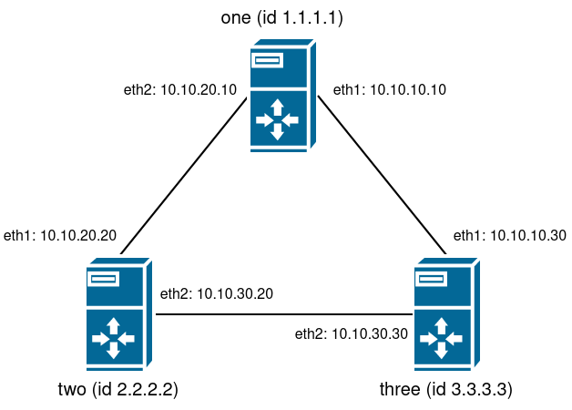

## Домашнее задание к занятию № 22 — «Статическая и динамическая маршрутизация»  <!-- omit in toc -->

### Оглавление  <!-- omit in toc -->

- [Задание](#Задание)
- [Создание стенда](#Создание-стенда)
- [Настройка динамической маршрутизации](#Настройка-динамической-маршрутизации)
- [Проверка асимметричного роутинга](#Проверка-асимметричного-роутинга)
- [Изменение стоимости маршрута и симметричный роутинг](#Изменение-стоимости-маршрута-и-симметричный-роутинг)
  - [Отключение асимметричного роутинга](#Отключение-асимметричного-роутинга)
  - [Изменение стоимости маршрута](#Изменение-стоимости-маршрута)

### Задание

1. Поднять три виртуальные машины.
2. Объединить их разными private network.
3. Поднять OSPF между машинами средствами программных маршрутизаторов на выбор: Quagga, FRR или BIRD.
4. Изобразить асимметричный роутинг.
5. Сделать один из линков «дорогим», но чтобы при этом роутинг был симметричным.

### Создание стенда

Создаваемые машины и сетевые интерфейсы описаны в [Vagrantfile](Vagrantfile).

Схема стенда:



Проверим работу без OSPF:

1. Выполним команду `vagrant up --no-provision`, чтобы создать стенд без вызова Ansible.
2. Выполним вход на одну из машин — пусть для примера это будет **one**: `vagrant ssh one`.
3. Удалим маршрут по умолчанию: `sudo ip r del default`.
4. Посмотрим таблицу маршрутизации:

    ```console
    [vagrant@one ~]$ ip r
    10.0.2.0/24 dev eth0 proto kernel scope link src 10.0.2.15 metric 100 
    10.10.10.0/24 dev eth1 proto kernel scope link src 10.10.10.10 metric 101 
    10.10.20.0/24 dev eth2 proto kernel scope link src 10.10.20.10 metric 102
    ```

5. Убедимся, что подсеть 10.10.30.0/24 недоступна:

    ```console
    [vagrant@one ~]$ ping 10.10.30.30
    connect: Network is unreachable
    ```

6. Перезапустим сервис network, чтобы восстановить маршрут по умолчанию (необходим для дальнейшей работы): `sudo systemctl restart network`.

### Настройка динамической маршрутизации

На хостовой машине выполним команду `vagrant provision`, чтобы запустить конфигурирование машин, которое включает в себя следующие шаги:

1. В директорию **/etc/sysconfig** копируется файл [network](provisioning/roles/ospf/templates/network.j2), в котором:
   - явно указано использование сети: `NETWORKING=yes`;
   - указано имя хоста (специфично для каждого сервера): `HOSTNAME=one`;
   - отключаются маршруты ZEROCONF (маршруты для сети 169.254.0.0/16): `NOZEROCONF=yes`.

2. Включается форвардинг пакетов: в каталог **/etc/sysctl.d** добавляется файл [forwarding.conf](provisioning/roles/ospf/files/forwarding.conf), содержащий следующую строку:

    ```
    net.ipv4.conf.all.forwarding = 1
    ```

3. Во всех файлах **/etc/sysconfig/network-scripts/ifcfg-eth\*** устанавливается параметр `NM_CONTROLLED=no`, отключающий управление интерфейсом посредством NetworkManager.
4. Проверяется, запущен ли сервис network (запускается, если нет).
5. Отключается сервис NetworkManager.
6. Устанавливаются пакеты: bird, traceroute и tcpdump.
7. В каталог **/etc** копируется файл конфигурации BIRD [bird.conf](provisioning/roles/ospf/templates/bird.conf.j2) с необходимыми настройками.
8. Запускается сервис bird.
9. Удаляется маршрут по умолчанию (для чистоты эксперимента).

Выполним вход на машину **one** и убедимся, что недоступная ранее сеть появилась в таблице маршрутизации:

```console
[vagrant@one ~]$ ip r
10.0.2.0/24 dev eth0 proto kernel scope link src 10.0.2.15 
10.10.10.0/24 dev eth1 proto kernel scope link src 10.10.10.10 
10.10.20.0/24 dev eth2 proto kernel scope link src 10.10.20.10 
10.10.30.0/24 proto bird 
        nexthop via 10.10.10.30 dev eth1 weight 1 
        nexthop via 10.10.20.20 dev eth2 weight 1

[vagrant@one ~]$ traceroute 10.10.30.30
traceroute to 10.10.30.30 (10.10.30.30), 30 hops max, 60 byte packets
 1  10.10.20.20 (10.10.20.20)  0.383 ms  0.300 ms  0.348 ms
 2  10.10.30.30 (10.10.30.30)  0.528 ms  0.560 ms  0.522 ms
```

В консоли BIRD:

```console
[vagrant@one ~]$ sudo birdc
BIRD 1.6.8 ready.
bird> show route
10.0.2.0/24        dev eth0 [MyOSPF 22:22:04] * I (150/10) [1.1.1.1]
10.10.10.0/24      dev eth1 [MyOSPF 22:22:04] * I (150/10) [1.1.1.1]
10.10.20.0/24      dev eth2 [MyOSPF 22:22:04] * I (150/10) [1.1.1.1]
10.10.30.0/24      multipath [MyOSPF 22:29:14] * I (150/20) [2.2.2.2]
        via 10.10.10.30 on eth1 weight 1
        via 10.10.20.20 on eth2 weight 1
```

Обратим внимание, что BIRD построил два маршрута до сети 10.10.30.0/24. За это отвечает параметр `ecmp`: при его включении BIRD создаёт несколько маршрутов до точки назначения, если стоимость путей одинакова.

### Проверка асимметричного роутинга

Отправим ICMP-пакеты с машины **one** на адрес 10.10.30.30 (интерфейс `eth2` машины **three**), при этом сканируя программой tcpdump интерфейсы: `eth1` на **two** (через который проходит маршрут согласно traceroute), `eth1` на **three** (который связан с **one** напрямую) и `eth1` на **one** (соседний интерфейс на этом же хосте).

```console
[vagrant@one ~]$ ping -c4 10.10.30.30
PING 10.10.30.30 (10.10.30.30) 56(84) bytes of data.
64 bytes from 10.10.30.30: icmp_seq=1 ttl=64 time=0.640 ms
64 bytes from 10.10.30.30: icmp_seq=2 ttl=64 time=0.963 ms
64 bytes from 10.10.30.30: icmp_seq=3 ttl=64 time=1.20 ms
64 bytes from 10.10.30.30: icmp_seq=4 ttl=64 time=1.04 ms

--- 10.10.30.30 ping statistics ---
4 packets transmitted, 4 received, 0% packet loss, time 3005ms
rtt min/avg/max/mdev = 0.640/0.962/1.200/0.204 ms
```

Вывод tcpdump на `eth1` машины **two**:

```console
[vagrant@two ~]$ sudo tcpdump -nnt -i eth1 icmp
tcpdump: verbose output suppressed, use -v or -vv for full protocol decode
listening on eth1, link-type EN10MB (Ethernet), capture size 262144 bytes
IP 10.10.20.10 > 10.10.30.30: ICMP echo request, id 8711, seq 1, length 64
IP 10.10.20.10 > 10.10.30.30: ICMP echo request, id 8711, seq 2, length 64
IP 10.10.20.10 > 10.10.30.30: ICMP echo request, id 8711, seq 3, length 64
IP 10.10.20.10 > 10.10.30.30: ICMP echo request, id 8711, seq 4, length 64
```

Вывод tcpdump на `eth1` машины **three**:

```console
[vagrant@three ~]$ sudo tcpdump -nnt -i eth1 icmp
tcpdump: verbose output suppressed, use -v or -vv for full protocol decode
listening on eth1, link-type EN10MB (Ethernet), capture size 262144 bytes
IP 10.10.30.30 > 10.10.20.10: ICMP echo reply, id 8711, seq 1, length 64
IP 10.10.30.30 > 10.10.20.10: ICMP echo reply, id 8711, seq 2, length 64
IP 10.10.30.30 > 10.10.20.10: ICMP echo reply, id 8711, seq 3, length 64
IP 10.10.30.30 > 10.10.20.10: ICMP echo reply, id 8711, seq 4, length 64
```

Вывод tcpdump на `eth1` машины **one**:

```console
[vagrant@one ~]$ sudo tcpdump -nnt -i eth1 icmp
tcpdump: verbose output suppressed, use -v or -vv for full protocol decode
listening on eth1, link-type EN10MB (Ethernet), capture size 262144 bytes
IP 10.10.30.30 > 10.10.20.10: ICMP echo reply, id 8711, seq 1, length 64
IP 10.10.30.30 > 10.10.20.10: ICMP echo reply, id 8711, seq 2, length 64
IP 10.10.30.30 > 10.10.20.10: ICMP echo reply, id 8711, seq 3, length 64
IP 10.10.30.30 > 10.10.20.10: ICMP echo reply, id 8711, seq 4, length 64
```

Из вывода tcpdump видно, что через **two** проходят только эхо-запросы, а через интерфейсы `eth1` на **one** и **three** — только эхо-ответы.

### Изменение стоимости маршрута и симметричный роутинг

#### Отключение асимметричного роутинга

Закомментируем на всех машинах параметр `ecmp` из файла **/etc/bird.conf** и перезапустим сервис bird командой `sudo systemctl restart bird`.

Убедимся, что теперь BIRD строит только один маршрут:

```console
[vagrant@one ~]$ ip r
10.0.2.0/24 dev eth0 proto kernel scope link src 10.0.2.15 
10.10.10.0/24 dev eth1 proto kernel scope link src 10.10.10.10 
10.10.20.0/24 dev eth2 proto kernel scope link src 10.10.20.10 
10.10.30.0/24 via 10.10.20.20 dev eth2 proto bird 

[vagrant@one ~]$ sudo birdc
BIRD 1.6.8 ready.
bird> show route
10.0.2.0/24        dev eth0 [MyOSPF 23:26:16] * I (150/10) [1.1.1.1]
10.10.10.0/24      dev eth1 [MyOSPF 23:26:35] * I (150/10) [1.1.1.1]
10.10.20.0/24      dev eth2 [MyOSPF 23:26:16] * I (150/10) [1.1.1.1]
10.10.30.0/24      via 10.10.20.20 on eth2 [MyOSPF 23:26:51] * I (150/20) [2.2.2.2]
```

Запомним вывод traceroute:

```console
[vagrant@one ~]$ traceroute 10.10.30.30
traceroute to 10.10.30.30 (10.10.30.30), 30 hops max, 60 byte packets
 1  10.10.20.20 (10.10.20.20)  0.367 ms  0.317 ms  0.291 ms
 2  10.10.30.30 (10.10.30.30)  0.507 ms  0.476 ms  0.368 ms
```

Повторим отправку ICMP-пакетов, сканируя те же интерфейсы:

```console
[vagrant@one ~]$ ping -c4 10.10.30.30
PING 10.10.30.30 (10.10.30.30) 56(84) bytes of data.
64 bytes from 10.10.30.30: icmp_seq=1 ttl=63 time=0.880 ms
64 bytes from 10.10.30.30: icmp_seq=2 ttl=63 time=1.74 ms
64 bytes from 10.10.30.30: icmp_seq=3 ttl=63 time=1.60 ms
64 bytes from 10.10.30.30: icmp_seq=4 ttl=63 time=1.38 ms

--- 10.10.30.30 ping statistics ---
4 packets transmitted, 4 received, 0% packet loss, time 3015ms
rtt min/avg/max/mdev = 0.880/1.402/1.745/0.330 ms
```

Вывод tcpdump на `eth1` машины **two**:

```console
[vagrant@two ~]$ sudo tcpdump -nnt -i eth1 icmp
tcpdump: verbose output suppressed, use -v or -vv for full protocol decode
listening on eth1, link-type EN10MB (Ethernet), capture size 262144 bytes
IP 10.10.20.10 > 10.10.30.30: ICMP echo request, id 10117, seq 1, length 64
IP 10.10.30.30 > 10.10.20.10: ICMP echo reply, id 10117, seq 1, length 64
IP 10.10.20.10 > 10.10.30.30: ICMP echo request, id 10117, seq 2, length 64
IP 10.10.30.30 > 10.10.20.10: ICMP echo reply, id 10117, seq 2, length 64
IP 10.10.20.10 > 10.10.30.30: ICMP echo request, id 10117, seq 3, length 64
IP 10.10.30.30 > 10.10.20.10: ICMP echo reply, id 10117, seq 3, length 64
IP 10.10.20.10 > 10.10.30.30: ICMP echo request, id 10117, seq 4, length 64
IP 10.10.30.30 > 10.10.20.10: ICMP echo reply, id 10117, seq 4, length 64
```

Теперь через **two** проходят оба типа сообщений: эхо-запросы и эхо-ответы, — в то время как вывод tcpdump на `eth1` машины **three** и `eth1` машины **one** пуст:

```console
[vagrant@three ~]$ sudo tcpdump -nnt -i eth1 icmp
tcpdump: verbose output suppressed, use -v or -vv for full protocol decode
listening on eth1, link-type EN10MB (Ethernet), capture size 262144 bytes
^C
0 packets captured
0 packets received by filter
0 packets dropped by kernel
```

```console
[vagrant@one ~]$ sudo tcpdump -nnt -i eth1 icmp
tcpdump: verbose output suppressed, use -v or -vv for full protocol decode
listening on eth1, link-type EN10MB (Ethernet), capture size 262144 bytes
^C
0 packets captured
0 packets received by filter
0 packets dropped by kernel
```

> ***Примечание.*** Если закомментировать параметр `ecmp` только на **one**, оставив его на двух других машинах, то эхо-ответы также будут отправлены через интерфейсы `eth1` машин **three** и **one**, но до источника так и не дойдут: такие пакеты отбрасываются, поскольку на **one** по умолчанию включён Reverse Path Filtering, а второй маршрут (`10.10.30.0/24 via 10.10.10.30`) отсутствует. Чтобы разрешить приём пакетов через другой интерфейс, необходимо присвоить параметру `rp_filter` для интерфейсов `eth1` и `all` значение 2 (нестрогая проверка) либо 0 (отсутствие проверки).

#### Изменение стоимости маршрута

Выполним вход на машину **two** и увеличим значение параметра `cost` в файле **/etc/bird.conf**:

```shell
protocol ospf MyOSPF {
    # ecmp;
    area 0 {
        interface "eth*" {
            cost 100;
        };
    };
}
```

Перезапустим сервис bird, чтобы изменения вступили в силу:

```console
[vagrant@two ~]$ sudo systemctl restart bird
```

Выполним вход на машину **one** и убедимся, что маршрут до сети 10.10.30.0/24 перестроен:

```console
[vagrant@one ~]$ ip r
10.0.2.0/24 dev eth0 proto kernel scope link src 10.0.2.15 
10.10.10.0/24 dev eth1 proto kernel scope link src 10.10.10.10 
10.10.20.0/24 dev eth2 proto kernel scope link src 10.10.20.10 
10.10.30.0/24 via 10.10.10.30 dev eth1 proto bird 

[vagrant@one ~]$ traceroute 10.10.30.30
traceroute to 10.10.30.30 (10.10.30.30), 30 hops max, 60 byte packets
 1  10.10.30.30 (10.10.30.30)  0.735 ms  0.846 ms  0.607 ms
```

Повторим отправку ICMP-пакетов, сканируя те же интерфейсы:

```console
[vagrant@one ~]$ ping -c4 10.10.30.30
PING 10.10.30.30 (10.10.30.30) 56(84) bytes of data.
64 bytes from 10.10.30.30: icmp_seq=1 ttl=64 time=0.451 ms
64 bytes from 10.10.30.30: icmp_seq=2 ttl=64 time=1.18 ms
64 bytes from 10.10.30.30: icmp_seq=3 ttl=64 time=0.797 ms
64 bytes from 10.10.30.30: icmp_seq=4 ttl=64 time=0.972 ms

--- 10.10.30.30 ping statistics ---
4 packets transmitted, 4 received, 0% packet loss, time 3008ms
rtt min/avg/max/mdev = 0.451/0.851/1.186/0.270 ms
```

Вывод tcpdump на `eth1` машины **one**:

```console
[vagrant@one ~]$ sudo tcpdump -nnt -i eth1 icmp
tcpdump: verbose output suppressed, use -v or -vv for full protocol decode
listening on eth1, link-type EN10MB (Ethernet), capture size 262144 bytes
IP 10.10.10.10 > 10.10.30.30: ICMP echo request, id 5503, seq 1, length 64
IP 10.10.30.30 > 10.10.10.10: ICMP echo reply, id 5503, seq 1, length 64
IP 10.10.10.10 > 10.10.30.30: ICMP echo request, id 5503, seq 2, length 64
IP 10.10.30.30 > 10.10.10.10: ICMP echo reply, id 5503, seq 2, length 64
IP 10.10.10.10 > 10.10.30.30: ICMP echo request, id 5503, seq 3, length 64
IP 10.10.30.30 > 10.10.10.10: ICMP echo reply, id 5503, seq 3, length 64
IP 10.10.10.10 > 10.10.30.30: ICMP echo request, id 5503, seq 4, length 64
IP 10.10.30.30 > 10.10.10.10: ICMP echo reply, id 5503, seq 4, length 64
```

Вывод tcpdump на `eth1` машины **three**:

```console
[vagrant@three ~]$ sudo tcpdump -nnt -i eth1 icmp
tcpdump: verbose output suppressed, use -v or -vv for full protocol decode
listening on eth1, link-type EN10MB (Ethernet), capture size 262144 bytes
IP 10.10.10.10 > 10.10.30.30: ICMP echo request, id 5503, seq 1, length 64
IP 10.10.30.30 > 10.10.10.10: ICMP echo reply, id 5503, seq 1, length 64
IP 10.10.10.10 > 10.10.30.30: ICMP echo request, id 5503, seq 2, length 64
IP 10.10.30.30 > 10.10.10.10: ICMP echo reply, id 5503, seq 2, length 64
IP 10.10.10.10 > 10.10.30.30: ICMP echo request, id 5503, seq 3, length 64
IP 10.10.30.30 > 10.10.10.10: ICMP echo reply, id 5503, seq 3, length 64
IP 10.10.10.10 > 10.10.30.30: ICMP echo request, id 5503, seq 4, length 64
IP 10.10.30.30 > 10.10.10.10: ICMP echo reply, id 5503, seq 4, length 64
```

Вывод tcpdump на `eth1` машины **two** пуст:

```console
[vagrant@two ~]$ sudo tcpdump -nnt -i eth1 icmp
tcpdump: verbose output suppressed, use -v or -vv for full protocol decode
listening on eth1, link-type EN10MB (Ethernet), capture size 262144 bytes
^C
0 packets captured
0 packets received by filter
0 packets dropped by kernel
```

<br/>

[Вернуться к списку всех ДЗ](../README.md)
