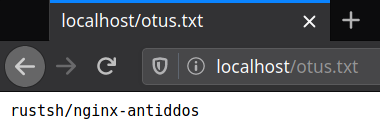
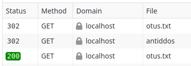

## Домашнее задание к занятию № 28 — «Web-серверы»  <!-- omit in toc -->

### Оглавление  <!-- omit in toc -->

- [Задание](#Задание)
- [Описание работы](#Описание-работы)
- [Проверка работы](#Проверка-работы)

### Задание

Реализовать простую защиту от DDOS средствами Nginx.

Написать конфигурацию Nginx, которая даёт доступ клиенту только с определенной cookie. Если у клиента её нет, нужно выполнить редирект на location, в котором cookie будет добавлена, после чего клиент будет отправлен обратно (редирект) на запрашиваемый ресурс.

Полное задание: https://gitlab.com/otus_linux/nginx-antiddos-example.

### Описание работы

1. Скопированы файлы по ссылке https://gitlab.com/otus_linux/nginx-antiddos-example.
2. В файл [otus.txt](otus.txt) записано название репозитория на hub.docker.com:

    ```
    rustsh/nginx-antiddos
    ```

3. Секция `server` в файле [nginx.conf](nginx.conf) приведена к следующему виду:

    ```nginx
    server {
        listen 80;
        root /opt;

        location /otus.txt {
            if ($cookie_access != "secretkey") {
                return 302 /antiddos;
            }
        }

        location /antiddos {
            add_header Set-Cookie "access=secretkey";
            return 302 /otus.txt;
        }
    }
    ```

4. На основе [Dockerfile](Dockerfile) собран образ rustsh/nginx-antiddos:latest, который опубликован на Docker Hub и доступен по ссылке https://hub.docker.com/repository/docker/rustsh/nginx-antiddos.

### Проверка работы

1. Запустим контейнер с Nginx, используя образ из репозитория:

    ```console
    $ docker run -d -p 80:80 rustsh/nginx-antiddos:latest
    ```

2. Выполним команду `curl localhost/otus.txt` и убедимся, что в ответе — редирект:

    ```console
    $ curl localhost/otus.txt
    <html>
    <head><title>302 Found</title></head>
    <body>
    <center><h1>302 Found</h1></center>
    <hr><center>nginx/1.17.10</center>
    </body>
    </html>
    ```

3. Откроем эту же страницу в браузере и убедимся, что выводится содержимое файла [otus.txt](otus.txt):

    

4. Дополнительно проверим вывод в консоли браузера:

    

<br/>

[Вернуться к списку всех ДЗ](../README.md)
