## Домашнее задание к занятию № 31 — «Динамический веб-контент»  <!-- omit in toc -->

### Оглавление  <!-- omit in toc -->

- [Задание](#Задание)
- [Описание работы](#Описание-работы)
  - [Предварительная информация](#Предварительная-информация)
  - [Подготовка стенда](#Подготовка-стенда)
  - [Ghost](#ghost)
  - [Teedy](#teedy)
  - [Netdata](#netdata)
  - [Nginx](#nginx)
- [Проверка работы](#Проверка-работы)
  - [Стартовая страница](#Стартовая-страница)
  - [Ghost](#ghost-1)
  - [Teedy](#teedy-1)
  - [Netdata](#netdata-1)

### Задание

Поднять веб-сервер, на котором будут работать три различные приложения, проксируемые через Nginx.

### Описание работы

#### Предварительная информация

В данной работе используются три сервиса:

- блог-платформа [Ghost](https://ghost.org/), написанная на JavaScript и использующая Node.js для работы;
- система управления документами [Teedy](https://teedy.io/), написанная на Java с использованием JavaScript;
- система мониторинга [Netdata](https://www.netdata.cloud/), написанная в основном на C.

Все сервисы работают в docker-контейнерах.

Сервисы проксируются через Nginx, который также находится в контейнере и связан с ними через единую docker-сеть. Плюс такого решения — порты контейнеров не требуется прокидывать наружу, минус — теряется гибкость в настройке файла **nginx.conf** (при его изменении необходимо или создавать новый контейнер, или использовать Docker Compose, в котором можно монтировать не только каталоги, но и отдельные файлы).

Пример связки Nginx и PHP-FMP можно посмотреть в домашнем задании к занятию по Docker ([ссылка](../hw-11)).

#### Подготовка стенда

Для создания виртуальной машины используется Vagrant ([Vagrantfile](Vagrantfile)), для её конфигурирования — Ansible.

Конфигурирование машины включает следующие шаги:

1. Добавление Docker-репозитория, установка и запуск Docker ([роль docker](provisioning/roles/docker)).
2. Добавление репозитория EPEL, установка pip, установка Docker SDK для Python для управления docker-контейнерами при помощи Ansible ([роль docker](provisioning/roles/docker)).
3. Создание docker-сети ([роль network](provisioning/roles/network)).
4. Запуск docker-контейнеров с сервисами (подробнее о них ­— ниже).
5. Запуск контейнера с Nginx. Он запускается последним, так как иначе будет постоянно перезапускаться, не найдя других сервисов, описанных в [default.conf](provisioning/roles/nginx/files/default.conf) ([роль nginx](provisioning/roles/nginx)).

#### Ghost

**Описание**: Блог-платформа.

**Язык**: JavaScript (Node.js)

**Сайт**: https://ghost.org/

**Ссылка на Github**: https://github.com/TryGhost/Ghost

**Ссылка на Docker Hub**: https://hub.docker.com/_/ghost

[Ссылка на роль ghost](provisioning/roles/ghost)

##### Ansible task для установки  <!-- omit in toc -->

```yml
- name: Install Ghost
  docker_container:
    name: ghost
    image: ghost:latest
    state: started
    restart_policy: always
    volumes:
      - /opt/ghost/content:/var/lib/ghost/content
    env:
      url: http://{{ host_ip }}/blog
    networks:
      - name: "{{ network }}"
```

##### Проксирование в Nginx  <!-- omit in toc -->

```nginx
location /blog {
    proxy_pass http://ghost:2368;
}
```

#### Teedy

**Описание**: Система управления документами.

**Язык**: Java/JavaScript

**Сайт**: https://teedy.io/

**Ссылка на Github**: https://github.com/sismics/docs

**Ссылка на Docker Hub**: https://hub.docker.com/r/sismics/docs

[Ссылка на роль teedy](provisioning/roles/teedy)

##### Ansible task для установки  <!-- omit in toc -->

```yml
- name: Install Teedy
  docker_container:
    name: teedy
    image: sismics/docs:v1.8
    state: started
    restart_policy: always
    volumes:
      - /opt/teedy/data:/data
    env:
      DOCS_BASE_URL: http://{{ host_ip }}/docs
    networks:
      - name: "{{ network }}"
```

##### Проксирование в Nginx  <!-- omit in toc -->

```nginx
location = /docs {
    return 301 /docs/;
}

location /docs/ {
    proxy_pass http://teedy:8080/;
}
```

#### Netdata

**Описание**: Система монитонга с визуализацией.

**Язык**: C

**Сайт**: https://www.netdata.cloud/

**Ссылка на Github**: https://github.com/netdata/netdata

**Ссылка на Docker Hub**: https://hub.docker.com/r/netdata/netdata

[Ссылка на роль netdata](provisioning/roles/netdata)

##### Ansible task для установки  <!-- omit in toc -->

```yml
- name: Install Netdata
  docker_container:
    name: netdata
    image: netdata/netdata
    state: started
    restart_policy: always
    volumes:
      - /etc/passwd:/host/etc/passwd:ro
      - /etc/group:/host/etc/group:ro
      - /proc:/host/proc:ro
      - /sys:/host/sys:ro
      - /etc/os-release:/host/etc/os-release:ro
    capabilities:
      - SYS_PTRACE
    security_opts:
      - apparmor=unconfined
    env:
      VIRTUALIZATION: kvm
    networks:
      - name: "{{ network }}"
```

##### Проксирование в Nginx  <!-- omit in toc -->

```nginx
location = /monitor {
    return 301 /monitor/;
}

location /monitor/ {
    proxy_pass http://netdata:19999/;
}
```

#### Nginx

Nginx работает в docker-контейнере и находится в той же docker-сети, что и остальные сервисы. Порты 80 и 443 прокинуты наружу. На хостовую систему прокинуты следующие каталоги:

- **/etc/nginx/conf.d** для хранения файла конфигурации [default.conf](provisioning/roles/nginx/files/default.conf);
- **/usr/share/nginx/html** — корневой каталог;
- **/var/log/nginx** для логов.

В файле [default.conf](provisioning/roles/nginx/files/default.conf) описаны настройки для проксирования сервисов. В корневом каталоге находится файл [index.html](provisioning/roles/nginx/templates/index.html.j2), представляющий собой описание HTML-страницы с ссылками на сервисы.

[Ссылка на роль nginx](provisioning/roles/nginx)

##### Ansible task для установки  <!-- omit in toc -->

```yml
- name: Install Nginx
  docker_container:
    name: nginx
    image: nginx:stable
    state: started
    restart_policy: always
    ports:
      - 80:80
      - 443:443
    volumes:
      - /opt/nginx/conf.d:/etc/nginx/conf.d
      - /opt/nginx/html:/usr/share/nginx/html
      - /opt/nginx/log:/var/log/nginx
    networks:
      - name: "{{ network }}"
```

### Проверка работы

Чтобы создать и сконфигурировать виртуальную машину, достаточно выполнить команду `vagrant up`.

#### Стартовая страница

Перейдём в браузере на IP-адрес, указанный в [Vagrantfile](Vagrantfile) — http://192.168.33.10/.

Убедимся, что открывается кастомная стартовая страница:

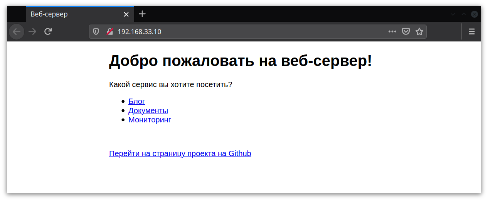

#### Ghost

Перейдём на страницу http://192.168.33.10/blog/ и убедимся, что открывается блог:

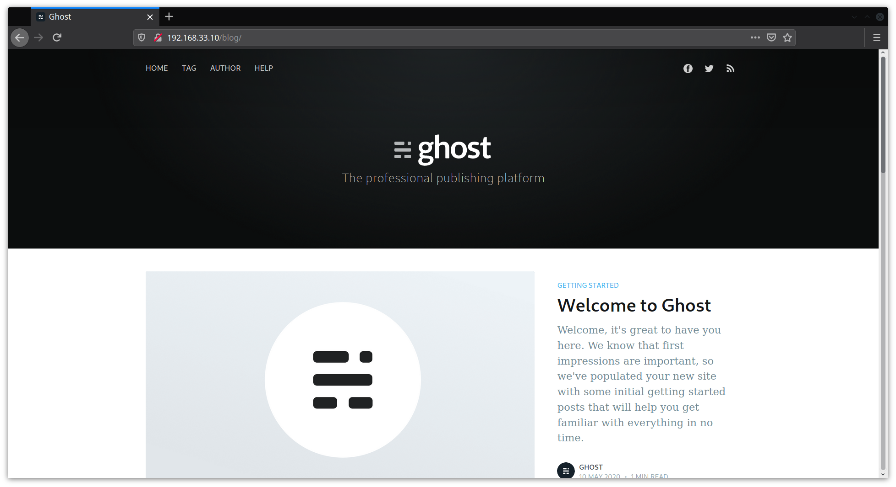

Чтобы создать аккаунт, перейдём по адресу http://192.168.33.10/blog/ghost/ и нажмём кнопку **Create your account**:

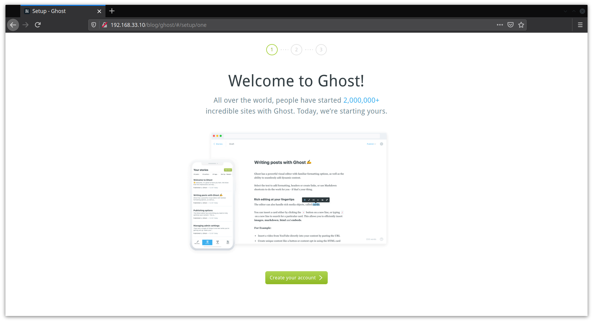

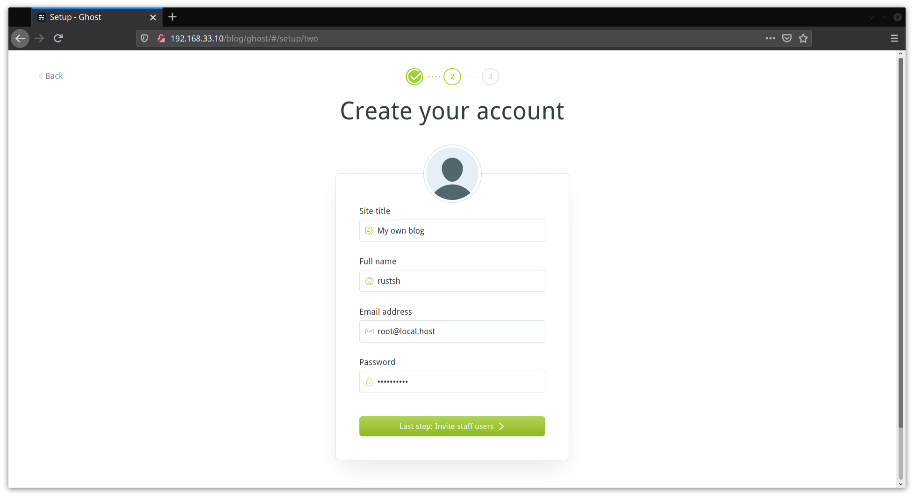

Теперь по адресу http://192.168.33.10/blog/ghost/ доступна панель администратора:

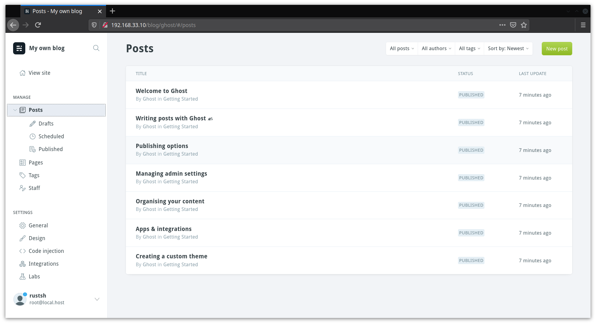

Создадим новый пост:

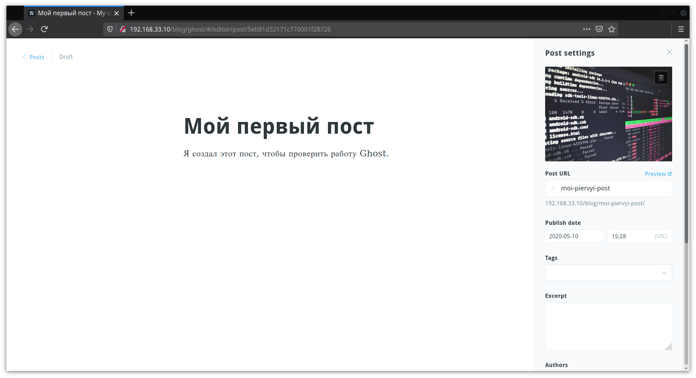

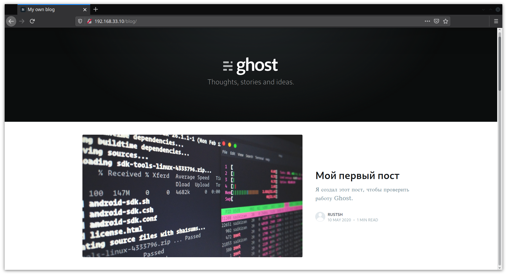

#### Teedy

Перейдём на страницу http://192.168.33.10/docs/ и убедимся, что открывается система управления документами:

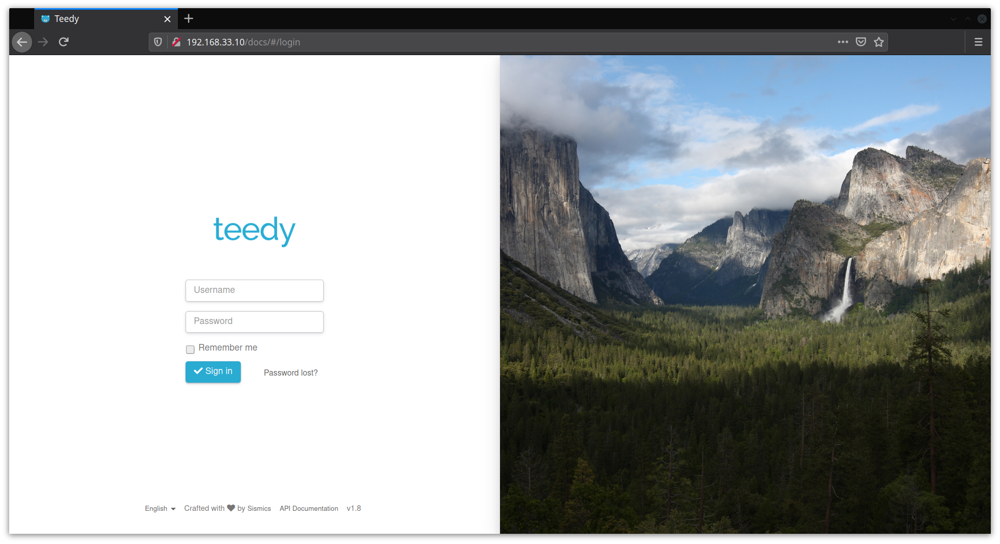

Имя пользователя по умолчанию — `admin`, пароль — `admin`. Выполним вход:

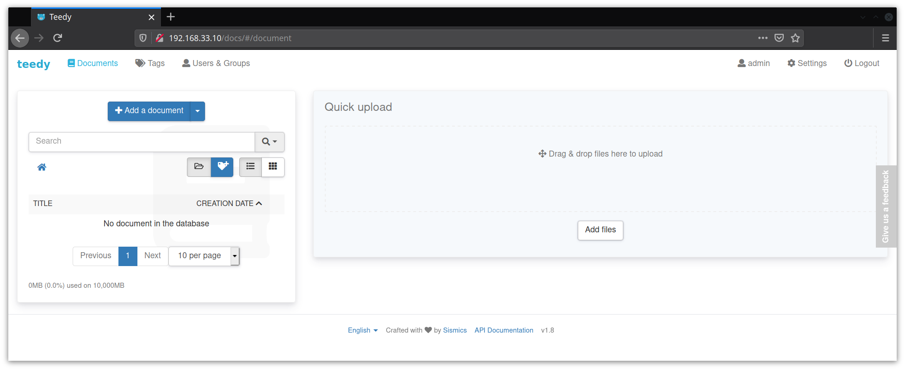

Создадим документ и добавим в него файл (или несколько):

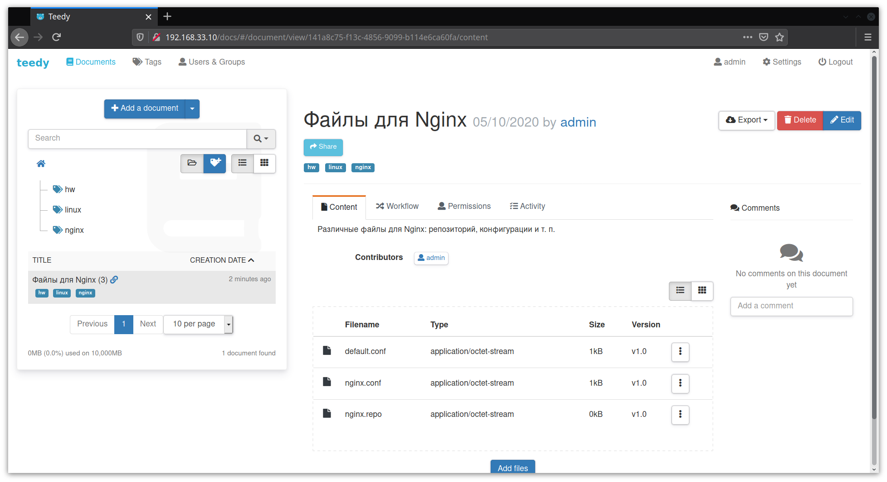

#### Netdata

Перейдём на страницу http://192.168.33.10/docs/ и убедимся, что открывается система мониторинга:

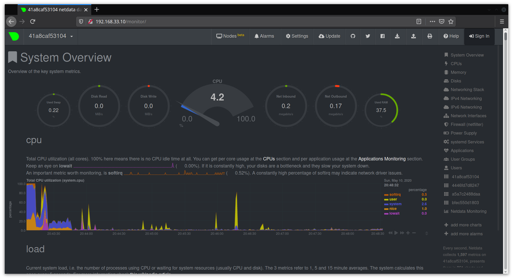

<br/>

[Вернуться к списку всех ДЗ](../README.md)
