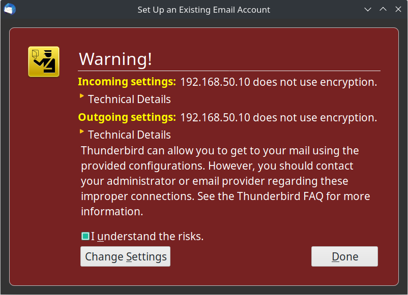

## Домашнее задание к занятию № 31 — «Почта: SMTP, IMAP, POP3»  <!-- omit in toc -->

### Оглавление  <!-- omit in toc -->

- [Задание](#задание)
- [Описание работы](#описание-работы)
- [Проверка работы](#проверка-работы)
  - [Отправка почты](#отправка-почты)
  - [Получение почты](#получение-почты)
  - [Дополнительные проверки](#дополнительные-проверки)

### Задание

1. Установить в виртуалке postfix+dovecot для приёма почты на виртуальный домен.
2. Отправить почту телнетом с хоста на виртуалку.
3. Принять почту на хост почтовым клиентом.

### Описание работы

В работе настраивается простейшая связка postfix + dovecot без дополнительных сервисов, баз данных и шифрования, но с использованием виртуального домена. Все пользователи виртуальных почтовых ящиков ассоциируются со специально созданным в системе пользователем vmail, их пароли хранятся в файле.

При выполнении команды `vagrant up` поднимается виртуальная машина mail ([Vagrantfile](Vagrantfile)), которая конфигурируется при помощи Ansible.

Шаги предварительной настройки:

1. Создаётся группа для пользователя, а затем и сам пользователь vmail для владения каталогом с виртуальными доменами и почтовыми ящиками (uid = 5000, gid = 5000).
2. Создаётся каталог **/var/spool/mail/vhosts** для виртуальных доменов, внутри него — каталог домена **virtual.otus**, их владельцем назначается пользователь vmail.
3. Проверяется, установлен ли в системе postfix, если нет — устанавливается.
4. Производится настройка postfix:

   - В файл [/etc/postfix/main.cf](provisioning/roles/mail/templates/postfix/main.cf.j2) вносятся основные настройки (в дополнение к настройкам по умолчанию):
        
        ```
        myhostname = mail.otus.lan
        mydomain = otus.lan
        myorigin = $mydomain
        inet_interfaces = all
        inet_protocols = all
        mydestination = $myhostname, localhost.$mydomain, localhost, $mydomain
        mynetworks = 192.168.0.0/16, 127.0.0.0/8
        home_mailbox = Maildir/
        smtpd_banner = $myhostname ESMTP $mail_name
        ```

   - В файл [/etc/postfix/main.cf](provisioning/roles/mail/templates/postfix/main.cf.j2) вносятся настройки для виртуальных доменов и почтовых ящиков:

       - `virtual_mailbox_domains = virtual.otus` — перечисление виртуальных доменов, для которых будет приниматься почта;
       - `virtual_mailbox_base = /var/spool/mail/vhosts` — базовый путь (префикс), где будут лежать почтовые ящики;
       - `virtual_mailbox_maps = hash:/etc/postfix/vmailbox` — путь до файла, где будут прописаны названия виртуальных почтовых ящиков и соответствующие им относительные пути до почтовых хранилищ;
       - `virtual_minimum_uid = 100` — минимальный uid, который может иметь владелец почтовых хранилищ (введен для повышения безопасности);
       - `virtual_uid_maps = static:5000` — uid владельца всех виртуальных почтовых хранилищ;
       - `virtual_gid_maps = static:5000` — gid владельца всех виртуальных почтовых хранилищ;
       - дополнительно может быть указан параметр `virtual_alias_maps = hash:/etc/postfix/virtual` — путь до файла, в котором могут храниться синонимы для перенаправления почты между доменами. В данной работе не используется.

   - В каталог **/etc/postfix** копируется файл [vmailbox](provisioning/roles/mail/templates/vmailbox.j2) c названиями почтовых ящиков и относительными путями до почтовых хранилищ:

        ```
        student@virtual.otus virtual.otus/student/Maildir/
        teacher@virtual.otus virtual.otus/teacher/Maildir/
        manager@virtual.otus virtual.otus/manager/Maildir/
        ```

        Абсолютный путь до почтового хранилища собирается из базового пути (заданного в параметре `virtual_mailbox_base`) и относительного пути. Таким орбазом, полный путь до почтового хранилища ящика **student@vitual.otus** следующий: **/var/spool/mail/vhosts/virtual.otus/student/Maildir**.

   - Выполняется команда:

        ```
        postmap /etc/postfix/vmailbox
        ```

        В результате в каталоге **/etc/postfix** создаётся файл **vmailbox.db**, который и будет использоваться postfix'ом.

5. Postfix перезапускается.
6. Устанавливается dovecot.
7. В файлы конфигурирования dovecot вносятся изменения:

   - [/etc/dovecot/dovecot.conf](provisioning/roles/mail/files/dovecot/dovecot.conf) — раскомментируются строки:

       - `protocols = imap pop3 lmtp` — обслуживаемые протоколы;
       - `listen = *` — список адресов, с которых можно принимать соединения;

   - [/etc/dovecot/conf.d/10-auth.conf](provisioning/roles/mail/templates/dovecot/10-auth.conf.j2):

       - `disable_plaintext_auth = no` — разрешается принимать пароли без шифрования;
       - `auth_default_realm = virtual.otus` — домен, который подставляется к логину, если он не задан;
       - `auth_mechanisms = plain login` — способы аутентификации;
       - `!include auth-passwdfile.conf.ext` — подключается файл **auth-passwdfile.conf.ext** с описанием стратегии хранения паролей (в данной работе пароли хранятся в файле);
       - `!include auth-static.conf.ext` — подключается файл **auth-static.conf.ext** с описанием стратегии хранения данных пользователей (в данной работе все виртуальные почтовые ящики ассоциируются пользователем vmail);

   - [/etc/dovecot/conf.d/10-logging.conf](provisioning/roles/mail/files/dovecot/conf.d/10-logging.conf):

       - `log_path = /var/log/dovecot.log` — файл для сообщений об ошибках;
       - `info_log_path = /var/log/dovecot-info.log` — файл для информационных сообщений;

   - [/etc/dovecot/conf.d/10-mail.conf](provisioning/roles/mail/files/dovecot/conf.d/10-mail.conf):

       - `mail_location = maildir:/var/spool/mail/vhosts/%d/%n/Maildir` — расположение почтовых ящиков, а также стратегия хранения сообщений. Указанное значение `maildir` означает, что хранилище — это каталог, а каждое письмо хранится в отдельном файле. Другая стратегия — `mbox`, когда все письма содержатся в одном общем файле;

   - [/etc/dovecot/conf.d/10-ssl.conf](provisioning/roles/mail/files/dovecot/conf.d/10-ssl.conf):

       - `ssl = no` — отключается использование SSL;

   - [/etc/dovecot/conf.d/auth-passwdfile.conf.ext](provisioning/roles/mail/files/dovecot/conf.d/auth-passwdfile.conf.ext) — расскомментируются все строки, кроме указанных:

        ```
        passdb {
          driver = passwd-file
          args = scheme=plain username_format=%n /etc/dovecot/users
        }
        ```

        Здесь задаётся стратегия хранения паролей (passdb):

          - `driver = passwd-file` — пароли хранятся в файле;
          - `scheme=plain` — пароли хранятся в открытом виде, без шифрования;
          - `username_format=%n` — имена пользователей указаны без доменов;
          - `/etc/dovecot/users` — полный путь до файла с паролями;

   - [/etc/dovecot/conf.d/auth-static.conf.ext](provisioning/roles/mail/files/dovecot/conf.d/auth-static.conf.ext) — расскомментируются все строки, кроме указанных:

        ```
        userdb {
          driver = static
          args = uid=vmail gid=vmail home=/var/spool/mail/vhosts/%d/%n
        }
        ```

        Здесь задаётся стратегия хранения пользователей (userdb). Для всех пользователей мы используем один UID и GID — от UNIX-пользователя vmail. При этом домашний каталог для каждого почтового пользователя должен быть уникален — это задаётся параметром `home=/var/spool/mail/vhosts/%d/%n`. Согласно [документации](https://wiki.dovecot.org/VirtualUsers/Home), домашний каталог не должен совпадать с директорией, в которой хранится почта.

8. В каталог **/etc/dovecot** копируется файл [users](provisioning/roles/mail/files/dovecot/users), в котором хранятся пароли пользователей виртуальных почтовых ящиков.
9. Dovecot перезапускается.

### Проверка работы

Чтобы создать и настроить виртуальную машину, достаточно выполнить команду `vagrant up`.

#### Отправка почты

Подключимся телнетом к виртуальной машине по IP-адрему, заданному в [Vagrantfile](Vagrantfile), указав порт 25, и отправим письмо на адрес **student@virtual.otus**:

```console
$ telnet 192.168.50.10 25
Trying 192.168.50.10...
Connected to 192.168.50.10.
Escape character is '^]'.
220 mail.otus.lan ESMTP Postfix
ehlo host
250-mail.otus.lan
250-PIPELINING
250-SIZE 10240000
250-VRFY
250-ETRN
250-ENHANCEDSTATUSCODES
250-8BITMIME
250 DSN
mail from: teacher@virtual.otus
250 2.1.0 Ok
rcpt to: student@virtual.otus
250 2.1.5 Ok
data
354 End data with <CR><LF>.<CR><LF>
Subject: First message

Hello! This is the test message.
Bye
.
250 2.0.0 Ok: queued as 0C0C54064D61
quit
221 2.0.0 Bye
Connection closed by foreign host.
```

#### Получение почты

В качестве почтового клиента используется [Thunderbird](https://www.thunderbird.net/).

Подключимся к почтовому аккаунту, указав адрес почты **student@virtual.otus**, пароль от него (заданный в файле [/etc/dovecot/users](provisioning/roles/mail/files/dovecot/users), в данной работе это `studpass`) и IP-адрес виртуальной машины в поле «Server hostname»:


Так как в работе не используется шифрование, Thunderbird выдаст предупреждение о небезопасном подключении. Примем риски и продолжим:



При подключении к аккаунту Thunderbird автоматически примет письмо, отправленное нами ранее через Telnet. Если этого не произошло, нужно нажать кнопку «Get messages»:


#### Дополнительные проверки

Можно проверить полученные письма через Telnet:

```console
$ telnet 192.168.50.10 110
Trying 192.168.50.10...
Connected to 192.168.50.10.
Escape character is '^]'.
+OK Dovecot ready.
user student
+OK
pass studpass
+OK Logged in.
list
+OK 1 messages:
1 345
.
retr 1
+OK 345 octets
Return-Path: <teacher@virtual.otus>
X-Original-To: student@virtual.otus
Delivered-To: student@virtual.otus
Received: from host (unknown [192.168.50.1])
        by mail.otus.lan (Postfix) with ESMTP id 3E32A4064D55
        for <student@virtual.otus>; Sat,  8 Aug 2020 08:22:39 +0000 (UTC)
Subject: First message

Hello! This is the test message.
Bye
.
quit
+OK Logging out.
Connection closed by foreign host.
```

Также можно посмотреть созданные каталоги и письма на виртуальной машине:

```console
[root@mail ~]# cd /var/spool/mail/vhosts/virtual.otus/student/Maildir/
[root@mail Maildir]# ls -l
total 24
drwx------. 2 vmail vmail   60 Aug  8 08:29 cur
-rw-------. 1 vmail vmail 1188 Aug  8 08:52 dovecot.index.cache
-rw-------. 1 vmail vmail  884 Aug  8 08:52 dovecot.index.log
-rw-------. 1 vmail vmail   24 Aug  8 08:52 dovecot.mailbox.log
-rw-------. 1 vmail vmail  107 Aug  8 08:29 dovecot-uidlist
-rw-------. 1 vmail vmail    8 Aug  8 08:29 dovecot-uidvalidity
-r--r--r--. 1 vmail vmail    0 Aug  8 08:29 dovecot-uidvalidity.5f2e625d
drwx------. 2 vmail vmail    6 Aug  8 08:29 new
-rw-------. 1 vmail vmail    6 Aug  8 08:52 subscriptions
drwx------. 2 vmail vmail    6 Aug  8 08:23 tmp
[root@mail Maildir]# ls -l new/
total 0
[root@mail Maildir]# ls -l cur/
total 4
-rw-------. 1 vmail vmail 335 Aug  8 08:23 1596875010.V801Ib0c43M481939.mail.otus.lan:2,S
[root@mail Maildir]# cat cur/1596875010.V801Ib0c43M481939.mail.otus.lan\:2\,S 
Return-Path: <teacher@virtual.otus>
X-Original-To: student@virtual.otus
Delivered-To: student@virtual.otus
Received: from host (unknown [192.168.50.1])
        by mail.otus.lan (Postfix) with ESMTP id 3E32A4064D55
        for <student@virtual.otus>; Sat,  8 Aug 2020 08:22:39 +0000 (UTC)
Subject: First message

Hello! This is the test message.
Bye
```

<br/>

[Вернуться к списку всех ДЗ](../README.md)
