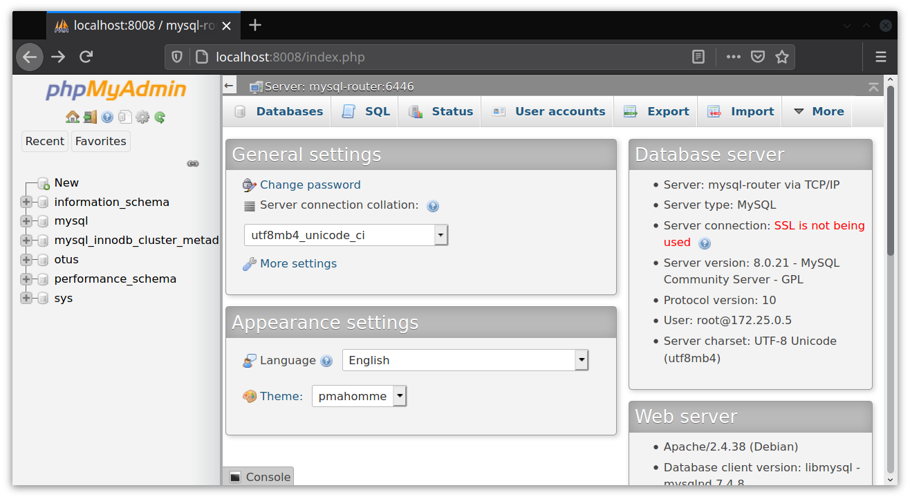
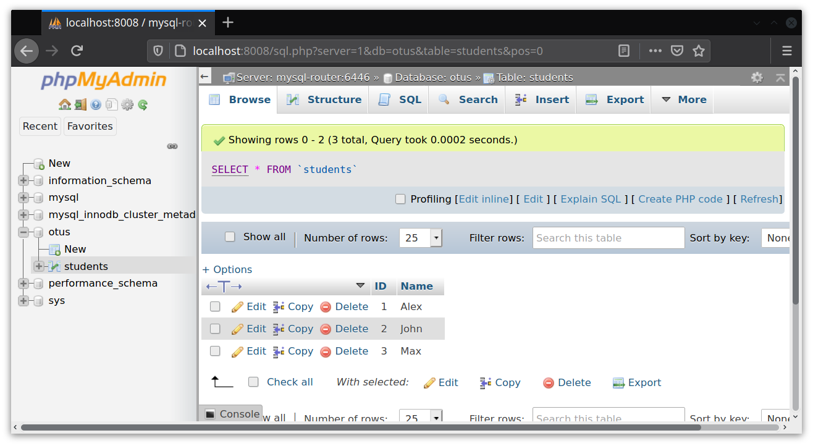
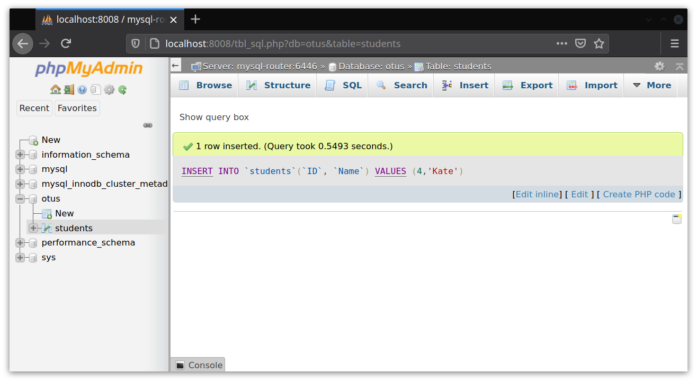
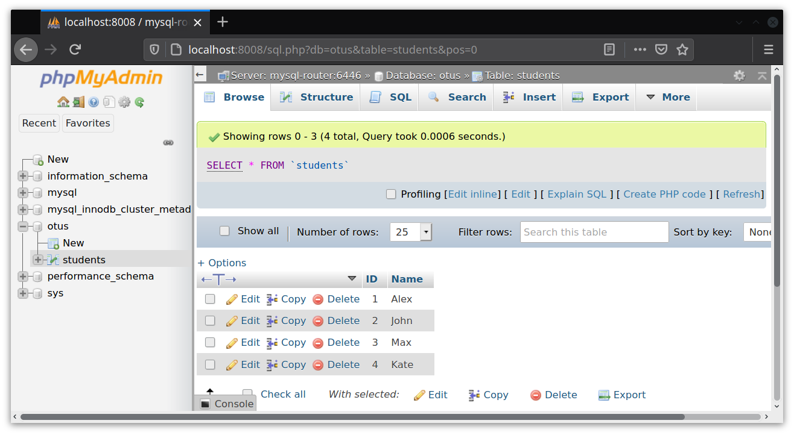

## Домашнее задание к занятию № 33 — «MySQL — бэкап, репликация, кластер»  <!-- omit in toc -->

### Оглавление  <!-- omit in toc -->

- [Задание](#задание)
- [Описание работы](#описание-работы)
- [Проверка работы](#проверка-работы)

### Задание

Развернуть InnoDB-кластер в Docker.

### Описание работы

За основу взята статья: https://mysqlrelease.com/2018/03/docker-compose-setup-for-innodb-cluster/. Пример из неё доведён до работоспособного состояния.

Порядок создания InnoDB-кластер в Docker:

1. Разворачивается три контейнера с MySQL Server.
2. Поднимается ещё один контейнер с mysqlsh, в нём выполняются скрипты по созданию кластера, а так же дополнительные SQL-скрипты (например, создание пользователей и баз данных). После выполнения всех скриптов контейнер останавливается.
3. Запускается контейнер с MySQL Router, который подключается к созданному кластеру.

Основная сложность состоит в том, что средствами Docker Compose нельзя контролировать готовность приложений внутри контейнеров (подробнее об этом можно почитать в [документации Docker](https://docs.docker.com/compose/startup-order/)). Поэтому для более гибкого управления порядком запуска приложений используется утилита [docker-compose-wait](https://github.com/ufoscout/docker-compose-wait).

При запуске команды `docker-compose up -d` выполняются следующие шаги:

1. На основе [Dockerfile](mysql-shell-batch/Dockerfile) создаётся контейнер, в котором будут выполнены [скрипты](scripts) MySQL Shell, в него копируется [основной скрипт](mysql-shell-batch/run.sh) и добавляется docker-compose-wait.
2. На основе [Dockerfile](mysql-router/Dockerfile) создаётся контейнер с MySQL Router, в него также добавляется docker-compose-wait.
3. Запускаются все контейнеры, описанные в файле [docker-compose.yml](docker-compose.yml). При этом контейнеры mysql-shell-batch и mysql-router ждут, когда все три сервера MySQL будут готовы к работе. Сами серверы MySQL запускаются с опциями для создания кластера, которые задаются в пункте `command`.
4. Когда все три сервера готовы к работе:
   - утилита docker-compose-wait в контейнере mysql-router включает паузу длиной 90 секунд, чтобы все скрипты в mysql-shell-batch успели закончить работу;
   - MySQL Shell внутри mysql-shell-batch выполняет скрипты:
     - [setupCluster.js](scripts/setupCluster.js) — создание кластера;
     - [db.sql](scripts/db.sql) — создание базы данных otus и пользователя otus, выдача прав пользователю для работы с этой базой.

    После выполнения всех скриптов контейнер mysql-shell-batch останавливается с кодом 0.

5. По истечении 90 секунд утилита docker-compose-wait передаёт управление внутреннему скрипту контейнера mysql-router, который запускает MySQL Router. Кластер готов к работе.

### Проверка работы

Запуск кластера занимает от пяти до десяти минут. Приступать к проверке можно после того, как контейнер mysql-shell-batch будет остановлен, а в логах mysql-router появятся сообщения о работе MySQL Router.

Для проверки можно использовать любое приложение, работающее с MySQL, на пример, [phpMyAdmin](https://www.phpmyadmin.net/).

Запустим контейнер с phpMyAdmin, включив его в одну сеть с созданными ранее контейнерами и указав контейнер с MySQL Router в качестве хоста:

```console
$ docker run --name myadmin -d -e PMA_HOST=mysql-router -e PMA_PORT=6446 -p 8008:80 --network=hw-33_default phpmyadmin/phpmyadmin
```

Откроем в браузере phpMyAdmin, перейдя по адресу http://localhost:8008/, авторизуемся, используя логин `root` и пароль `mysql` (пароль задайтся в файле [mysql-server.env](mysql-server.env)), и убедимся, что есть подключение и что наша база данных действительно создана:



Добавим в базу таблицу и заполним её данными:



Остановим контейнер mysql-server-1:

```console
$ docker-compose stop mysql-server-1
```

Обновим страницу и убедимся, что данные всё равно читаются, а также есть возможность добавлять новые данные:





<br/>

[Вернуться к списку всех ДЗ](../README.md)
